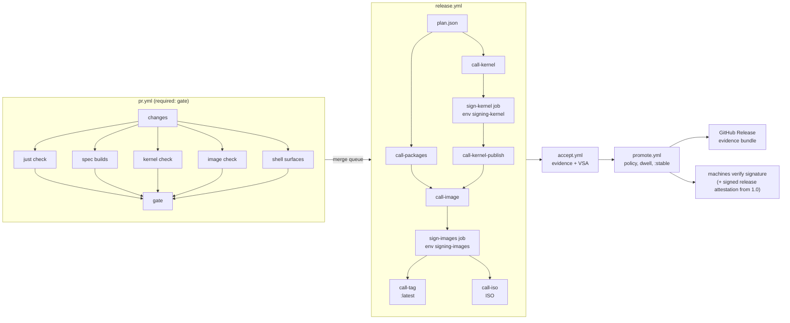

# Pipeline: target architecture of CI/CD

- **Purpose:** the target state of the pipeline that turns a commit into signed, attested,
  accepted and promoted artifacts, with the operations the EU Cyber Resilience Act expects
  of a manufacturer, and the ordered plan that reaches it. [doc_ci.md](doc_ci.md) describes
  the workflows as they are; this document describes what they become and why.
- **Owner:** the maintainer.
- **Status:** approved at revision 2 (2026-10-07). Revision 2 applies the adversarial review
  of the accepted architecture, is rewritten on `iso-v0` at `e238b833` (after #265, #266 and
  #268), lists its changes in section 15, and the decisions it changes are recorded in
  ADR-0088. The maintainer approved revision 1 and
  answered PQ1-PQ12 as recommended on 2026-10-07; the blocks of section 12 are built in order. Measured figures come from the GitHub API run data of 2026-09-23 to
  2026-10-07 (784 runs) collected by the pipeline review of 2026-10-07; every other number is
  labelled as an estimate. Amended 2026-10-07 (#265): the target's two signing jobs are jobs of `release.yml`,
  not reusable stages, because a called workflow's job does not read its environment's secrets
  ([actions/runner#4453](https://github.com/actions/runner/issues/4453); section 3.2).
- **Depends on:** [doc_update_delivery.md](doc_update_delivery.md) (UD1-UD44: channels,
  promotion, retention, pinning), [doc_update_trust.md](doc_update_trust.md) (UT1-UT13),
  [doc_build_ordering.md](doc_build_ordering.md) (O1-O9), [doc_build_system.md](doc_build_system.md),
  [doc_kernel_build.md](doc_kernel_build.md), [doc_system_image.md](doc_system_image.md),
  [doc_ci.md](doc_ci.md) (CI1-CI28), the secrets inventory
  [secrets.md](../operations/secrets.md), the settings record
  [github-settings.md](../operations/github-settings.md).
- **Binding decisions:** [ADR-0080](../decisions/0080-pipeline-architecture.md) (this
  architecture and the two signing environments), [ADR-0088](../decisions/0088-pipeline-revision-2.md)
  (its amendments by revision 2), [ADR-0081](../decisions/0081-cra-compliance-posture.md)
  (CRA posture, support period, archive), [ADR-0082](../decisions/0082-update-control.md)
  (update control), [ADR-0075](../decisions/0075-engineering-gates.md) (`just check`),
  [ADR-0076](../decisions/0076-platform-scope-for-1-0.md), [A2-4](../decisions/0039-delivery-repairs-before-1-0.md),
  [A2-27](../decisions/0064-signing-approvals-and-mok-enrolment.md).
- **Defines:** PL1-PL53 (requirements), PB0-PB12 and PB5b (plan blocks), PQ1-PQ12 (decisions on the review questions).
- **Enforced by:** `python3 scripts/verify.py` once the checks of section 10 exist; until
  then, by review against this document.

Where this document and doc_update_delivery.md cover the same ground (channels, promotion,
retention, pinning), doc_update_delivery.md stays the owner and this document cites its UD
requirements instead of restating them. This document owns the shape of the workflows, the
end-to-end trust chain, the CRA operations, the performance budget, observability and
maintainability.

## 1. Principles

Each principle names the standard it comes from. The pipeline is judged against these, not
against convenience.

| #  | Principle                                                                                                                                                | Standard                                                                                                                                                                                                                                                                                                                        |
| -- | -------------------------------------------------------------------------------------------------------------------------------------------------------- | ------------------------------------------------------------------------------------------------------------------------------------------------------------------------------------------------------------------------------------------------------------------------------------------------------------------------------- |
| 1  | Every artifact a machine or another stage consumes and that is built on a GitHub-hosted runner reaches **SLSA Build L3**: hosted, isolated build, provenance generated by a reusable workflow whose identity is the signer. Artifacts built on the self-hosted runner claim **Build L2** (PL21). | SLSA v1.0 levels, https://slsa.dev/spec/v1.0/levels; GitHub, https://docs.github.com/en/actions/security-for-github-actions/using-artifact-attestations/using-artifact-attestations-and-reusable-workflows-to-achieve-slsa-v1-build-level-3 |
| 2  | Every claim about an artifact is an **in-toto attestation** bound to its digest; the acceptance outcome is a **Verification Summary Attestation** (VSA).  | in-toto attestation framework, https://github.com/in-toto/attestation; SLSA VSA, https://slsa.dev/spec/v1.0/verification_summary                                                                                                                                                                                          |
| 3  | The secure-development practices are traceable to **NIST SSDF** (SP 800-218): PO.3.2, PO.5.1, PS.2, PS.3, PW.4, PW.7, PW.8, RV.1.1.                     | https://csrc.nist.gov/pubs/sp/800/218/final                                                                                                                                                                                                                                                                                     |
| 4  | Repository and workflow hygiene meet the **OpenSSF Scorecard** checks (Token-Permissions, Pinned-Dependencies, Branch-Protection, Code-Review, Dangerous-Workflow, SAST, Signed-Releases, Vulnerabilities, Security-Policy). | https://github.com/ossf/scorecard/blob/main/docs/checks.md; GitHub hardening guide, https://docs.github.com/en/actions/security-for-github-actions/security-guides/security-hardening-for-github-actions |
| 5  | The product meets **CRA Annex I** Parts I and II as a manufacturer would, with the obligations that apply from 2027-12-11 (ADR-0081).                    | Regulation (EU) 2024/2847, https://eur-lex.europa.eu/eli/reg/2024/2847/oj                                                                                                                                                                                                                                                       |
| 6  | **GitHub as glue.** Logic lives in scripts under the repository; a workflow checks out, calls them and uploads their output. A `run:` block holds at most about five lines. | Standing rule of 2026-09-10 (CLAUDE.md)                                                                                                                                                                                                                                                                                         |
| 7  | **One gate, run locally and in CI.** `just check` is the gate a contributor runs and the gate a pull request must pass (ADR-0075).                       | SSDF PW.7, PW.8                                                                                                                                                                                                                                                                                                                 |
| 8  | **File contracts between stages.** Stages exchange typed files in a known directory, never only `$GITHUB_OUTPUT` or an artifact name.                   | Standing rule of 2026-09-10                                                                                                                                                                                                                                                                                                     |
| 9  | **Content-addressed consumption.** Inside the build chain every input is named by digest or content hash and verified before use; no mutable tag is read. | SLSA Build L3 (isolation of inputs), SSDF PS.2, UD28, UD43                                                                                                                                                                                                                                                                       |
| 10 | **Simplest design that meets the standard.** A tool that adds an operator, a cluster or a second build language must earn its place against a repository script. | Section 11                                                                                                                                                                                                                                                                                                                      |

## 2. Decisions this document records

These are the maintainer's, and this document does not reopen them.

1. **Two signing environments (D43).** `signing-kernel` holds the Secure Boot and module
   signing keys; its job signs the NVIDIA modules and `vmlinuz`, published as `azoth-boot`.
   `signing-images` holds the cosign key. Both deploy only from the protected branches
   `iso-v0` and `main`. A release cycle asks for **at most two approvals** (amends A2-27).
   A job that holds a key builds nothing and runs no third-party action, and
   `verify.py workflows` enforces it. `MOK_PRIVATE_KEY` is retired.
   [ADR-0088](../decisions/0088-pipeline-revision-2.md) amends ADR-0080: the plan gains PB5b
   and the stages gain `call-iso.yml` (section 3.2); Build L3 is claimed for artifacts built
   on GitHub-hosted runners and Build L2 for the self-hosted kernel and the signed derivatives
   (PL21), and a spike decides between a repository script and Conforma's `ec` CLI for the
   policy gate (PL30); `MOK_PRIVATE_KEY` is retired at the close of the image key rotation
   (PB5b); `prevent_self_review` waits for a second human reviewer (PL5); the security class
   is set and signed when the release is signed (PQ4); agents on the workstation push with a
   GitHub App identity, not a token (PL5); and SBOMs carry each ecosystem's strongest hash,
   with SHA-512 for what Athanor delivers and the gap a documented deviation (PL24).
2. **No compiler cache for the kernel** (PR #250).
3. **CRA: comply now, at manufacturer level** (ADR-0081). Support period of five years for
   the product line, with the Fedora base rebased forward and the end date published.
   Digests promoted to `:stable` are never deleted. A signed evidence bundle per release is
   attached to a GitHub Release, with no off-GitHub copy for now. Updates are automatic by
   default, with a time-limited postpone and an opt-out with a warning (ADR-0082, amends
   A2-26 and A2-5). Full wipe follows 1.0; ADR-0076 stands and the gap is documented.
4. **Product priorities (2026-10-06):** update delivery first; the pipeline is the
   product; x86-64-v3 only.
5. **Secret scanning and push protection** are on (2026-10-07) and are part of the
   recorded settings (PL9).

Merged work is part of the system this document targets: PR #248 (packages consumed by
content hash, `hash-` tags written last from the signed digest), PR #249 (the `system`
stage built once, UD40), PR #250 (no kernel ccache), PR #253 (sign-only jobs, D43), and
since revision 1: PR #265 (the signing jobs run in the entry workflow, section 3.2), PR
#266 (`pr.yml`, `gate`, `just check` and the known-red list, PB1), PR #268 (one lint per
release run, one package matrix, PL48) and PR #274 (every installed RPM checked against its
spec in the system stage).

## 3. Target topology

This section describes the target. Of its files, only `pr.yml` and `call-kernel.yml` (PR
#266), `maintenance.yml` (PR #264, with the settings drift check of PL52 alone) and the `kvm`
composite action exist on `iso-v0`; every other entry workflow, stage and
composite action, and the `sign-kernel` and `sign-images` jobs, are proposed. Today the
two signing jobs are `nvidia-kmod-sign` (environment `signing-kernel`) and
`sign-system-images` (environment `signing` during the image key rotation of
[secrets.md](../operations/secrets.md) section 4.1) of `athanor-forge-orchestrator.yml`
(PR #265). Section 3.5 maps each of today's workflows to its target.

### 3.1 Entry workflows

Six workflows have triggers. Everything else is a reusable stage they call, except the two
jobs that sign, which are jobs of `release.yml` itself (section 3.2).

| Entry            | Triggers                                       | What it does                                                                                                                                                       |
| ---------------- | ---------------------------------------------- | ------------------------------------------------------------------------------------------------------------------------------------------------------------------ |
| `pr.yml`         | `pull_request`, `merge_group`                  | change detection, `just check`, the build checks the change selects (specs, kernel, image, shell surfaces) on `pull_request` only (PL44), one aggregate job `gate`, the only required check |
| `release.yml`    | `push` to `iso-v0` and `main`, `workflow_dispatch` | plan, packages, kernel and modules when their inputs changed, signing of the kernel, images, signing of the images, `:latest`, ISO, release evidence             |
| `accept.yml`     | `workflow_call` from `release.yml`, `workflow_dispatch` with a run id | ISO and upgrade acceptance on the run's own digests (UD17, UD18), evidence files, the VSA                                       |
| `promote.yml`    | hourly `schedule`, `workflow_dispatch`         | selects the candidate with complete evidence after the dwell (UD5), runs the policy check, promotes by digest, publishes the evidence bundle; checks out `RELEASE_BRANCH` (VAR4), not the default branch the schedule runs on |
| `bots.yml`       | daily `schedule`, `workflow_dispatch`          | one matrix over the bump scripts (kernel, cosmic-comp, nixpkgs registry, specs, NVIDIA locks); each opens or updates one pull request through one shared script  |
| `maintenance.yml`| daily and weekly `schedule`, `workflow_dispatch` | vulnerability rescan, settings drift check, run statistics; weekly: janitor, reproducibility and benchmark, fuzzing, patch rebase drill, two-output layout, Scorecard |

### 3.2 Reusable stages and composite actions

| Stage (reusable workflow) | Role                                                                                                    | Runs where                         |
| ------------------------- | ------------------------------------------------------------------------------------------------------- | ---------------------------------- |
| `call-builder.yml`        | the builder image, by content hash (UD42)                                                               | hosted                             |
| `call-packages.yml`       | one matrix over the dirty packages of `plan.json`; tier repositories by `hash-` tag (PR #248, UD44)      | hosted                             |
| `call-kernel.yml`         | Azoth, `azoth-devel`, the NVIDIA modules once per kernel or NVIDIA change, unsigned. Today it is the kernel check `pr.yml` calls (build, boot, modules, verdict), publishing nothing | self-hosted ephemeral guest (build), hosted (the rest) |
| `call-kernel-publish.yml` | after the `sign-kernel` job of `release.yml`: boots the signed modules, publishes `azoth-nvidia` and `azoth-boot` with the provenance of the signed derivatives (PL19) | hosted, KVM for the boot |
| `call-image.yml`          | the `system` stage once and the three variants from its digest (UD40), every installed RPM checked against its spec (`system/check-image-rpms.sh`, PR #274); pushes `:<run_id>` only (UD24) | hosted                             |
| `call-tag.yml`            | after the `sign-images` job of `release.yml`: verifies the key-based signature as a machine does, then moves the tags (UD25) | hosted |
| `call-iso.yml`            | after the `sign-images` job of `release.yml`: builds the ISO from the signed digest of the default image, signs its `SHA256SUMS` keylessly with build provenance beside it, moves the ISO's `:latest` (PL32, PL35). Today the ISO is built in `call-system-image.yml` | hosted |

The two jobs that hold a key are not stages: `sign-kernel` (environment `signing-kernel`)
and `sign-images` (environment `signing-images`) are jobs of `release.yml`, each between
the stage that hands it digests and the stage that publishes what it signed, all of them
exchanging files through the run's artifacts. A job of a called workflow reads the secrets
of its environment only when its caller passes `secrets: inherit`
([actions/runner#4453](https://github.com/actions/runner/issues/4453)): in run 37598455557 the sign job of `nvidia-kmod.yml`, called
by the Orchestrator without it, ran with both kernel keys empty although `signing-kernel`
holds them. An inherit would hand every secret of the repository to every job of the
stage, which D43 forbids, so a signing job lives in the workflow the event starts, where
its environment resolves. `verify.py workflows` rejects a job of a signing environment in
a workflow that has `workflow_call` among its triggers.

The build stages generate SLSA provenance themselves, so the signer identity of every
attestation is the stage, not the caller (PL21).

Composite actions carry the repeated steps, never logic:

- `.github/actions/setup`: checkout and the pinned tools from the repository flake;
- `.github/actions/attest`: provenance and SBOM attestations for a digest file;
- `.github/actions/verify-input`: verifies a consumed digest against its expected signer
  identity and writes the verified digest file;
- `.github/actions/alert`: opens or updates the alert issue when a scheduled run fails (PL51);
- `.github/actions/kvm`: KVM access for the runner user on hosted runners, for the boot and
  acceptance jobs (exists).

### 3.3 File contracts

Every stage reads and writes files under `$RUNNER_TEMP/out/` and uploads that directory.
The schemas live in `scripts/ci/schemas/` and every writer validates against them.

| File                          | Writer                    | Readers                         | Content                                                                                             |
| ----------------------------- | ------------------------- | ------------------------------- | --------------------------------------------------------------------------------------------------- |
| `changes.json`                | `pr.yml` change detection | `pr.yml` jobs                   | the areas a change touches (specs, kernel, docs only; image and shell join with their `pr.yml` jobs in PB11, PB12). Known gap: `Cargo.toml`, `Cargo.lock` and `deny.toml` belong to no area yet, so a dependency change selects no build (follow-up) |
| `plan.json`                   | release `plan`            | every release stage             | dirty packages with content hashes, whether kernel or modules change, the variants of `images.json` |
| `kernel-artifacts.env`        | `system/kernel-artifacts.sh` | image, signing                | kernel, devel, module and boot digests and their registry (O5)                                      |
| `tier-digests.json`           | `call-packages.yml`       | `call-image.yml`                | tier repository digests, verified (UD44)                                                            |
| `image-digests.txt`           | `call-image.yml`          | signing, ISO, accept, promote   | `REPOSITORY TAG DIGEST` per variant (UD3)                                                           |
| `evidence/<gate>.json`        | each acceptance gate      | promote                         | UD4 evidence                                                                                        |
| `vsa.intoto.json`             | `accept.yml`              | promote                         | SLSA VSA over the run's digests                                                                     |
| `promotion.json`              | `promote.sh`              | evidence bundle                 | UD6 record                                                                                          |
| `metrics/<stage>.json`        | every stage               | `maintenance.yml` statistics    | durations, cache use, bytes pushed (PL53)                                                           |

### 3.4 The flow

### 3.5 Today's 29 workflows

| Workflow                         | Target                                                                                             |
| -------------------------------- | -------------------------------------------------------------------------------------------------- |
| `athanor-forge-orchestrator.yml` | replaced by `release.yml`; its `nvidia-kmod-sign` and `sign-system-images` jobs (PR #265) become the `sign-kernel` and `sign-images` jobs |
| `azoth-signer.yml`               | merged into `bots.yml`: the signer image is built by the content hash of its inputs, with provenance (PL19), and the bump of `forge/specs/azoth/signer/image.digest` is a bot pull request, not a hand edit |
| `call-build-builder.yml`         | kept as `call-builder.yml`, consumed by digest                                                     |
| `call-dag-compile.yml`           | renamed `call-packages.yml`; it already builds every dirty package in one matrix (PR #268, PL48) |
| `call-kernel.yml`                | kept: today the kernel check of `pr.yml` (PR #266); it gains the release build of `kernel-build.yml` and the module build of `call-nvidia-kmod-prepare.yml` |
| `call-lint.yml`                  | deleted: `just check` in `pr.yml`; the release path does not lint again (PL44). Today the Orchestrator calls it once per run (PR #268) and `kernel-build.yml` once more |
| `call-nvidia-kmod-prepare.yml`   | merged into `call-kernel.yml`: since PR #265 it holds the artifacts, build and prepare jobs of the module cycle |
| `call-system-image.yml`          | split into `call-image.yml`, `call-tag.yml` and `call-iso.yml`, which takes over its ISO build; its signing job already moved to the Orchestrator (PR #265) and becomes the `sign-images` job of `release.yml` |
| `cosmic-comp-bump.yml`           | merged into `bots.yml`                                                                             |
| `cosmic-comp-rebase.yml`         | merged into `maintenance.yml` (weekly)                                                             |
| `forge-ghcr-cleanup.yml`         | merged into `maintenance.yml` (weekly janitor, section 5)                                               |
| `forge-util-update-specs.yml`    | merged into `bots.yml`                                                                             |
| `fuzzing.yml`                    | deleted: it had no targets (`tests/fuzz` is gone); fuzzing returns in `maintenance.yml` (weekly, section 3.1) when a crate has a target |
| `iso-acceptance.yml`             | replaced by `accept.yml`, addressed by run id (UD17)                                               |
| `kernel-build.yml`               | split: the check into `pr.yml` (done through `call-kernel.yml`, PR #266; its own `pull_request` trigger goes with the PB1 follow-up), the build and the publication into `call-kernel.yml`. It signs nothing: `vmlinuz` is signed by the Orchestrator's `nvidia-kmod-sign`, which becomes `sign-kernel` |
| `kernel-bump.yml`                | merged into `bots.yml`                                                                             |
| `kernel-weekly.yml`              | merged into `maintenance.yml` (weekly)                                                             |
| `maintenance.yml`                | kept (PR #264, the daily settings drift check of PL52); gains the scheduled jobs merged into it (PB12) |
| `nix-registry-bump.yml`          | merged into `bots.yml`                                                                             |
| `nix-vanguard.yml`               | deleted: its triggers name a branch without a release role and `just check` covers the flake      |
| `nvidia-build.yml`               | merged into `call-kernel.yml`                                                                      |
| `nvidia-kmod.yml`                | since PR #265 the boot and publication of the signed modules and `azoth-boot`: becomes `call-kernel-publish.yml`, whose identity `system/kernel-artifacts.sh` then trusts (PL12, D43) |
| `pr.yml`                         | kept (PR #266); gains the image check and the shell surfaces (PB11, PB12)                         |
| `promote-stable.yml`             | replaced by `promote.yml`                                                                          |
| `rust-security-audit.yml`        | deleted: `cargo deny` in `just check` (ADR-0075), the daily rescan in `maintenance.yml`            |
| `shell-layout-outputs.yml`       | merged into `maintenance.yml` (weekly)                                                             |
| `shell-surfaces.yml`             | merged into `pr.yml`, selected by change detection, the bar built once (PL45)                      |
| `spec-build-check.yml`           | merged into `pr.yml`, selected by change detection                                                 |
| `system-image-check.yml`         | merged into `pr.yml`, selected by change detection                                                 |

29 files become 13 (six entries, seven stages) plus five composite actions.

## 4. The trust chain, end to end

### 4.1 Source and review

**PL1. The product branches are protected by rulesets kept as code.** `iso-v0` and `main`
reject force pushes and deletions, require a pull request, require the `gate` check of
`pr.yml` and linear history. The rulesets live in `.github/settings/rulesets.json`, as two
rulesets, because a bypass actor is exempt from every rule of the ruleset that names it: the
integrity ruleset (merge queue, required `gate`, linear history, no force push, no deletion)
has **no bypass actor**; the review ruleset (pull request, with a code-owner review once a
second code owner exists, PL4) is the only one with a bypass actor, in the "for pull requests
only" mode. The bypass actor is the repository Admin role (`RepositoryRole` 5), which the
maintainer alone holds today: a ruleset does not accept a single user as a bypass actor.
Today `rulesets.json` (PR #264) holds one ruleset, `product-branches`, whose bypass therefore
also covers the merge queue and `gate`; PB2 splits it in two.
(SSDF PS.1; Scorecard Branch-Protection.)

**PL2. Changes land through the merge queue.** The `gate` runs on the `merge_group` commit,
so what lands passed `just check` in its merged state, and its builds are proven on the pull
request and again by the release build (PL44), and the required check stays `strict: false` without
losing that guarantee. (Scorecard Branch-Protection.) Deferred on 2026-10-08 (PIPE-N06): the queue is not in `.github/settings/rulesets.json` until every required context is reported on `merge_group` (the legacy `Kernel gate` and `Spec gate` are not), and `verify.py workflows` refuses it before then; until it returns, a pull request lands by squash-merge once `gate` is green on its head.

**PL3. One required check, always reported.** `gate` depends on every job of `pr.yml`, runs
with `if: always()`, and fails when any job it needs failed or was cancelled; a skipped job
is a pass. Path filters never decide whether a required workflow runs: the change-detection
job decides which jobs run, so a required check is never left pending
(https://docs.github.com/en/repositories/configuring-branches-and-merges-in-your-repository/managing-protected-branches/troubleshooting-required-status-checks).

**PL4. CODEOWNERS names existing owners and existing paths,** and `verify.py` checks both.
Pull requests opened by an agent or a bot require the review of a code owner once a second
code owner exists: until then "Require review from Code Owners" stays off
([ADR-0062](../decisions/0062-governance-targets-confirmed.md), A2-25; PR #264 sets it in
`.github/settings/`), and the merge queue and `gate` are the controls on those pull requests. The
repository Admin role, held by the maintainer alone, is the bypass actor of the review ruleset
only, in the "for pull requests only" mode, recorded in the settings file (PL1, PQ5): the maintainer's own pull requests merge without a second
review and still pass the merge queue and `gate`. No one pushes directly to a product
branch, in an emergency either: an urgent fix is a pull request whose change detection
selects the minimum.

**PL5. Agents and bots act through GitHub App identities, never personal tokens.** Tokens
come from `actions/create-github-app-token` per job, scoped to the repository and the
permissions the job needs, and expire within the hour. Personal access tokens are removed
from the repository secrets. There is one App per role, the bots and the agents. Agents on
the workstation push with their App identity, not with a fine-grained token: a token of the
maintainer would make an agent's pull request the maintainer's, which passes under the review
bypass and voids the code-owner review of PL4. The bots' App private keys live in environments
scoped to the job that mints their tokens, never as a repository secret; the agents' App private
key lives in the maintainer's secret store. Each key has a row in
`docs/operations/secrets.md` for its custody and rotation.

`prevent_self_review` stays off while the maintainer is the only required reviewer of the
signing environments. GitHub refuses the approval of the user who triggered the run
(https://docs.github.com/en/actions/managing-workflow-runs-and-deployments/managing-deployments/managing-environments-for-deployment),
and the maintainer triggers every release they merge, dispatch or re-run, so the switch
would leave those runs without a possible approver. Approval resting on one account is an
accepted risk, bounded by the deployment branch restriction to the protected branches, the
integrity ruleset without bypass (PL1), the key isolation of PL11 and the absence of an
administrator bypass (PL15). Which actor GitHub records for a push made by the merge queue,
and so who triggered the release run it starts, is measured in PB2's gate.
`prevent_self_review` is switched on when a second human reviewer is listed in both
environments (D43, ADR-0088).

**PL6. Bot pull requests merge through the same queue and the same gate.** Auto-merge is
enabled by the bot's App identity from a default-branch run, never from a job that runs
pull-request code.

### 4.2 Workflow and build isolation

**PL7. Least privilege per job.** Every workflow declares `permissions: {}` at the top and
each job asks for exactly what it uses. No workflow uses `pull_request_target` or
`workflow_run` with pull-request code. `verify.py workflows` enforces both. (Scorecard
Token-Permissions, Dangerous-Workflow.)

**PL8. Everything executed is pinned.** Actions by full commit SHA (with
`sha_pinning_required: true` in the repository settings, switched on only once every action
is pinned by SHA, the action part of `verify.py pinning`, so no workflow fails at start in
between), container images by digest
(UD43), tools from the repository flake and its `flake.lock`, never from an unpinned
`nixpkgs#` reference. `verify.py` gains a `pinning` check. The self-hosted runner's release is pinned by SHA-256
(`scripts/runner/build-image.sh`), the runner is configured not to replace itself when a job
is assigned (verified on the runner VM in PB3), and a bot bumps the pin before GitHub's
support window for runner releases closes. (Scorecard Pinned-Dependencies; SSDF PS.2.)

**PL9. Repository security settings are code.** Secret scanning, push protection,
private vulnerability reporting, Dependabot alerts, Actions permissions and environments
are recorded under `.github/settings/`, and the drift check of PL52 compares them with the
live repository.

**PL10. Jobs of different trust levels never share writable state.** Pull-request jobs
and release jobs never read a cache, volume or runner state the other wrote. On the
self-hosted runner each job runs in an ephemeral guest (`scripts/runner/`) whose cache
volumes are separate per trust level; a pull request from a fork never runs on it (PQ3).
Release-path builds restore no cache: a cache is an input the provenance does not name
(PL20), and any job of the default branch can write one; the kernel made the same choice
(PR #250). Pull-request builds may restore caches by prefix. `verify.py workflows` rejects a
cache step in a release-path job. Today `call-dag-compile.yml` restores a Rust and an
sccache cache on the release path; they go with PB11.

**PL11. A job that holds a signing key builds nothing and runs no third-party action**
(D43). It runs the pinned signer image on the exact digests a build job handed over, and
`verify.py workflows` rejects any other step in a job that names an environment with a key,
and such a job in a reusable workflow (section 3.2).

### 4.3 Intermediate artifacts

**PL12. Every hop is consumed by digest and verified with an exact identity.** Each
artifact one stage hands to another (builder image, the `azoth-signer` image, package images
by `hash-` tag, tier repositories, kernel, devel, modules, boot image) is resolved to a digest once, verified
with `cosign verify` (or `gh attestation verify`) against the exact certificate identity
of the stage that produced it, and used only by that digest. An identity is matched as an
exact string, not a pattern. This extends UD44 from tier repositories to every hop.

**PL13. Tags inside the build chain are names, not inputs.** `hash-<h>` and `<run_id>` tags
are written once, after the signature of the digest they name verified (PR #248, UD25);
`latest` is never read by a build stage. A pull request builds against the digests its
own pins resolve to, never against a moving tag.

**PL14. The trusted namespace is one variable.** Every image reference is built from
`REGISTRY_HOST` and the repository owner, each with a default, from one script
(`scripts/ci/registry.sh`); the variant list comes from one file,
`forge/config/images.json`. RA-12's single literal stays the only exception. The key-isolation
lint of `verify.py workflows` reads the registry from the same variable instead of matching a
literal host, and recognises the runners a signing job may use from an explicit allow-list,
not from a pattern.

### 4.4 Signing

**PL15. Two key domains, two environments** (D43): `signing-kernel` (Secure Boot key for
`vmlinuz`, module key for the NVIDIA modules) and `signing-images` (cosign key). Each
deploys only from `iso-v0` and `main`, has `can_admins_bypass: false`, and lists required
reviewers. A release that does not change the kernel asks for one approval.

**PL16. Sign, verify, then tag** (UD25). The signing job verifies the signature it wrote
through the same policy a machine uses before any tag moves.

**PL17. Keyless signatures accompany key-based ones** (UT2): the keyless Sigstore
signature carries the workflow identity; the key-based one is what machines verify
offline.

**PL18. Key rotation and revocation are runbooks,** in `docs/operations/`, each a
sequence of releases (UD27): new key shipped in a promoted image, then used.

### 4.5 Provenance

**PL19. Every artifact has SLSA provenance:** packages, tier repositories, builder image,
the `azoth-signer` image, kernel, devel, modules, boot image, the three system images and the ISO. Provenance is the
`https://slsa.dev/provenance/v1` predicate, generated by `actions/attest-build-provenance`
inside the stage that built the artifact, in the job that built it, so the provenance's
runner environment is the build's. The signed derivatives are the one exception: the signed
`vmlinuz` of `azoth-boot` and the signed NVIDIA modules of `azoth-nvidia` are new bytes
written by the `sign-kernel` job, which runs no step but the signer (PL11). Their provenance
is generated by `call-kernel-publish.yml`, names the unsigned digest and the signing run as
its inputs, and claims Build L2 (PL21).

**PL20. Provenance names its inputs by digest:** source commit, builder digest, base image
digest, tier digests, kernel artifacts. A digest absent from the provenance is an input
the build must not have read.

**PL21. Build L3 is verified, not claimed.** `scripts/ci/verify_release.sh <run_id>` runs
`gh attestation verify --signer-workflow` for every digest of the run against the stage
that must have built it, and the release evidence records the result. Public statements claim the level this script
verifies and nothing higher (RA-3). The script passes `--deny-self-hosted-runners` for every
artifact claimed at Build L3 and records each attestation's runner environment in the
evidence. Artifacts built on the self-hosted runner (`azoth`, `azoth-devel`, the debuginfo
and MicroVM kernels) and the signed derivatives of PL19 (the signed `vmlinuz` of
`azoth-boot`, which carries that build's bytes, and the signed modules of `azoth-nvidia`)
claim Build L2. Build L3 for the kernel would need its build on a hosted runner, which is
not planned; for a signed derivative it would need provenance from the job that wrote its
bytes, which PL11 forbids.

### 4.6 SBOM

**PL22. One SBOM format: CycloneDX 1.6 JSON,** generated by the pinned syft for every
artifact of PL19 and attested with the CycloneDX predicate type. Why CycloneDX 1.6: BSI
TR-03183-2 v2.1.0, which is the most concrete technical reading of the CRA's SBOM duty
available, accepts CycloneDX 1.6 or later or SPDX 3.0.1 or later, with SHA-512 hashes
(https://www.bsi.bund.de/SharedDocs/Downloads/EN/BSI/Publications/TechGuidelines/TR03183/BSI-TR-03183-2_v2_1_0.pdf).
The pipeline emits SPDX 2.3 today, which that reading does not accept; CycloneDX 1.6 is
supported by the scanners of PL25 and by syft. SPDX 3 is reconsidered when the toolchain
emits it.

**PL23. The SBOM covers the top level and the inside.** The system images list every RPM
and, through `cargo auditable` metadata in the Rust binaries, every crate; the kernel SBOM
lists its configuration and patches; the ISO SBOM names the image digest it installs.

**PL24. The SBOM is checked, not only produced.** `scripts/ci/sbom_check.py` fails a
release whose SBOM lacks, for any component, a name, a version, a supplier, a licence, a
PURL, a dependency relation, or the strongest hash its ecosystem publishes (SHA-256 for RPMs
and crates). Every file Athanor builds and delivers (the images by digest, the ISO,
`vmlinuz`, the modules, the evidence bundle) also carries a SHA-512 hash. TR-03183-2 asks
for the SHA-512 of every component's deployable form; no tool in the chain produces it for
upstream RPMs and crates, so that gap is a documented deviation in `docs/compliance/`, not a
check relaxed at release time. `sbom_check.py` has a fixture test for each ecosystem (RPM,
crate, image, kernel).

### 4.7 Vulnerabilities

**PL25. Every candidate is scanned before promotion.** `scripts/vuln/scan.sh` runs grype
on the SBOM, osv-scanner on `Cargo.lock`, and `dnf updateinfo` against the image's RPM
database. Its report is an evidence file of UD4.

**PL26. Exploitability is recorded as VEX.** Statements live in
`security/vex/*.openvex.json` (OpenVEX, https://github.com/openvex/spec), are reviewed like
code, and are passed to the scanner. A finding of high or critical severity blocks promotion when
a fixed version is available in the enabled repositories and no VEX statement of
`not_affected` or `fixed` covers it (grype `--only-fixed`, or the equivalent filter of each
scanner). A finding without a fixed version is reported in the evidence and does not block;
a `not_affected` statement is written only with its analysis.

**PL27. Promoted digests are rescanned daily** by `maintenance.yml`. A new finding against
`:stable` with a fixed version available opens the CVD workflow of section 6 and raises the
alert of PL51; findings without a fix are listed in the weekly statistics.

**PL28. Static analysis runs on every pull request** through `just check` (clippy, ruff,
shellcheck, actionlint, cargo deny) and CodeQL runs weekly for Rust, Python and the
workflows. (SSDF PW.7, PW.8; Scorecard SAST.)

### 4.8 Acceptance, VSA and promotion

**PL29. Acceptance produces a VSA.** `accept.yml` runs the ISO and upgrade acceptance on
the run's own digests (UD17, UD18) and writes a SLSA VSA
(`https://slsa.dev/verification_summary/v1`) whose `resourceUri` is each digest, whose
`policy` names the version of `scripts/ci/policy.json`, and whose `verifiedLevels` records
the SLSA level PL21 verified. The VSA is attested keylessly by `accept.yml`.

**PL30. Promotion verifies a policy, not a list of files.** `promote.sh` calls
`scripts/ci/policy_check.py`, which reads `policy.json` and verifies, for every digest:
the key-based signature, provenance from the expected stage, an SBOM that passes PL24, a
scan without blocking findings (PL26), the VSA, and the evidence of UD4. The `hardware`
evidence of the NVIDIA variants counts only as a signed statement (an in-toto predicate
signed by the maintainer's identity or by a key `policy.json` names) attached to the digest;
until `athanor-update report-evidence` produces one, an NVIDIA variant promotes only through
an explicit **[M]** override that the evidence bundle records. Before PB5 builds
`policy_check.py`, a spike runs Conforma's `ec validate image`, which runs standalone without
Kubernetes (https://conforma.dev/docs/user-guide/cli.html), against one release run: if it
evaluates these rules, PL30 is `ec` with a policy in the repository and `policy_check.py` is
a thin wrapper; if not, section 11 records the measured reason.

**PL31. Releases have one monotonic order.** Machines order releases by the build time of
UT9 (`org.opencontainers.image.created`), never by the version string; its serial is a
display value, since a CI run number restarts when a workflow file is renamed (PB12). The
build time is signed when the release is signed, in the key-signed attestation of the
`sign-images` job (environment `signing-images`) that also carries the security class (PQ4), so an offline machine
verifies it with the shipped key (UT2, UT3). A machine refuses an image whose signed build
time is older than the one it runs (UT5, UD7). This gives the rollback protection of TUF without a
TUF repository (section 11). Freeze protection, an expiry that machines enforce, needs a
signature renewed on a schedule, and so a key in a scheduled job; promotion holds no key
(PL42). An expiry is therefore not part of this design: it needs a new requirement in
doc_update_trust.md before any key is placed in a scheduled job.

### 4.9 Install path and machines

**PL32. The ISO is signed and names its image by digest.** The ISO is built after the
images are signed, so its `SHA256SUMS` is signed keylessly (Sigstore) by the stage that
built it, `call-iso.yml`, with build provenance beside it, and published with the ISO: no key and no
approval, and a user verifies it with `cosign verify-blob` against that exact workflow
identity (PQ2). The kickstart installs the promoted digest through the signed transport
(UD2), and the installer carries the policy of UT3 (UD22).

**PL33. Every machine verifies before it switches** (UD11, UD23): signature through the
shipped policy, and from 1.0 the key-signed release attestation of PL31 (build time and
security class).

**PL34. The maintainer's machines leave the unverified transport** by UD15's three steps,
onto `ostree-image-signed` under `ars-regia` (UD11), as block PB6 with a maintainer
action.

## 5. Release channels and retention

**PL35. One rule per tag, one writer per tag** (UD1). `:<run_id>` and `hash-<h>` are
immutable names written once; `:latest` is written on a push to the default branch only: for the system
images by `call-tag.yml` after it verified the key-based signature as a machine does (UD25),
for the ISO by `call-iso.yml` after its keyless signature verified (PL32); the
kernel has no `:latest`, since every consumer reads it by digest (PL13). `:stable`,
`:stable-previous`, `:stable-<YYYYMMDD>` are written only by `promote.sh`. There is one
writer per tag and repository, and `verify.py workflows` enforces it in the workflows and in
the scripts they call (`system/sign-images.sh`, `system/promote.sh`) (UD1 acceptance).
Today the `dag-system-image` job of `call-system-image.yml` pushes the system images by
`:<run_id>` only, and `tag-system-images` of the Orchestrator moves their `:latest` after
`verify-system-images` verified the key-based signature, and on `main` the ISO's `:latest`
in the same job; `call-build-builder.yml` moves the builder's `:latest` on default-branch runs
(`forge/scripts/promote_builder_latest.sh`, PR #228), which the pull-request spec check
reads until it consumes the builder by digest (PL13).

Retention, by ADR-0081 (this amends the 90-day figure of UT10 and UD8):

| What                                                                 | Kept                                                         |
| -------------------------------------------------------------------- | ------------------------------------------------------------ |
| digests ever promoted to `:stable`, their signatures and attestations | forever (never deleted from GHCR)                            |
| `hash-<h>` package and tier images named by the provenance of a promoted release | as long as that release: they are the inputs it rebuilds from |
| other `hash-<h>` images                                              | 30 days after the last run that referenced them              |
| referrers of a kept digest (signatures, attestations, SBOMs, VSAs)   | as long as the digest                                        |
| ISOs of promoted runs                                                | forever (UD8)                                                |
| `:<run_id>` images never promoted                                    | 90 days                                                      |
| untagged manifests not referenced by a kept index or signature       | 7 days                                                       |
| evidence bundle per promoted release                                 | attached to its GitHub Release, never deleted                |
| workflow artifacts                                                   | the repository default of 90 days, unless the upload sets fewer |

The janitor (`forge/scripts/clean_ghcr.sh`, weekly in `maintenance.yml`) computes the kept
set by reachability from the promoted roots: the promoted digests, the inputs their
provenance names, and the referrers of each. It always runs its dry run first, refuses to
delete a member of that set, and has a unit test on a fixture graph.

**The support period** is five years for the product line from the date it is placed on
the market, with the Fedora base rebased forward within the line (ADR-0081, amends
A2-17). The line is each major version, and its five years run from the date 1.0 is
placed on the market (PQ7). The end date is published in `SECURITY.md`, in the release
notes and as `SUPPORT_END` in `/usr/lib/os-release` (`athanor-base-config`). The 1.0
release adds `SUPPORT_END`; images before it carry none, because no support period is
promised for them. The acceptance of the 1.0 release asserts it
(`grep SUPPORT_END /usr/lib/os-release`), the check PB7 leaves to that release.

## 6. CRA operations

Items marked [LAWYER] need legal confirmation before they are relied on; the CRA review
of 2026-10-07 found that Athanor, distributed free of charge by a natural person, is
probably outside the CRA today [LAWYER], and the maintainer chose to meet the
manufacturer's obligations anyway (ADR-0081).

**PL36. Classification is recorded.** An operating system is an important product of
class I (Annex III, item 11). Each variant is a product. The conformity route for free
and open-source software under Art. 32(5) applies, with the technical documentation
public [LAWYER].

**PL37. Coordinated vulnerability disclosure.** `.github/SECURITY.md` is the CVD policy
(Annex I Part II(5)): the reporting channel (GitHub private vulnerability reporting, plus
an e-mail address, PQ8), what is in scope, the response times the maintainer commits to,
the support period and its end date, and how advisories are published.

**PL38. Art. 14 reporting runbook.** `docs/compliance/reporting-runbook.md` describes, for
an actively exploited vulnerability or a severe incident: the 24-hour early warning, the
72-hour notification, the final report (14 days after a fix for a vulnerability, one month
for an incident), through the ENISA single reporting platform
(https://portal.cra-srp.enisa.europa.eu/) to the coordinating CSIRT (CSIRT Italia
[LAWYER]), and the notice to users. Art. 14 applies from 2026-09-11 to products in scope.

**PL39. Advisories are CSAF 2.0 and GHSA.** Every fixed vulnerability gets a GitHub
security advisory and a CSAF 2.0 document
(https://docs.oasis-open.org/csaf/csaf/v2.0/os/csaf-v2.0-os.html) published as a provider
on the project's Pages site, with the VEX statements of PL26 as its product status. (Annex
I Part II(4), (6), (8).)

**PL40. Technical documentation exists in the repository.** `docs/compliance/` holds the
Annex VII skeleton: product description and intended use, design and development (links
to `docs/architecture/`), the cybersecurity risk assessment, the Annex I mapping (each
essential requirement to the requirement or check that meets it), the SBOM location, the
support period, the EU declaration of conformity template [LAWYER]. It is kept ten years
after the last product of the line is placed on the market (Art. 13(13)), which the git
history and the GitHub Releases provide.

**PL41. Security updates are separate and free.** The security class of UT13 is the CRA's
security update (Art. 13(8), (9); Annex I Part II(8)); it is never bundled behind a
feature confirmation, and update control follows ADR-0082: automatic by default, a
postpone limited in time, an opt-out in Settings with a warning (Annex I Part I(2)(c)).

**PL42. The evidence bundle.** Each promotion publishes a GitHub Release named after the
version (UT9), with the SBOMs, provenance, VSA, scan report, VEX, `promotion.json` and
the acceptance evidence, plus a `bundle.sha256` file that `promote.yml` signs keylessly (Sigstore, the workflow
identity), since the bundle exists only at promotion, long after the release's signing
jobs ended; promotion therefore holds no key. ADR-0081 accepts GitHub as the only store
for now.

Known gaps, documented in `docs/compliance/` rather than hidden: full wipe (LUKS
crypto-erase) after 1.0 (ADR-0076), the harmonised standards still in draft (ETSI EN
304 626 for operating systems, prEN 40000-1-3), the logging opt-out (Annex I Part I(2)(l))
[LAWYER].

## 7. Performance

### 7.1 Measured baselines

Wall time is `updated_at - created_at` of a run, which includes queue and approval waits;
p50/p90 over successful runs. Source: run data of 2026-09-23 to 2026-10-07, recomputed for
this document from the review's export.

| Path                            | Runs (success) | Wall p50 / p90 (min) | Notes                                                                                               |
| ------------------------------- | -------------- | -------------------- | --------------------------------------------------------------------------------------------------- |
| Kernel Build (every PR and push) | 216 of 321    | 10.9 / 77.1          | reuse path p50 9.9 min; compile 48-74 min, p50 65.8 min (21 builds)                                  |
| System Image Check              | 44 of 129      | 26.3 / 58.6          | 34% success over the window                                                                         |
| Shell surfaces                  | 56 of 70       | 17.5 / 36.0          | the bar is built in 14 jobs: 75.1 of 203 job-minutes per run, the largest job-hour consumer (128 h) |
| Spec Build Check                | 53 of 77       | 5.0 / 28.9           |                                                                                                     |
| Orchestrator, image runs        | 18             | 113 / 299            | about 62 min of work, 6.5 min of repeated lint, 38.7 min (34%) of approval wait                      |
| Orchestrator, all               | 22 of 95       | 108.9 / 298.9        | 50 of 95 cancelled; 25.9 h of self-hosted time on cancelled builds                                  |
| Docs-only PR gate               | 1 (run 37543730456) | 7.5             | a documentation change runs Kernel Build                                                            |

Other measured facts: the Actions cache held 10.78 GB against the 10 GB limit, with a
Rust cache no job restores; before PR #248, 89% of DAG job-minutes rebuilt nothing; the
declared timeouts are 5 to 20 times the longest observed run (kernel 360 min against a
74-minute maximum, system image 180 against 55, DAG levels 60 against about 3.3, modules
60 against 5).

### 7.2 Targets

Targets are estimates until PB11 measures them; each becomes a metric of PL53.

| Path                                    | Target wall p50                                       | How                                                                               |
| --------------------------------------- | ----------------------------------------------------- | --------------------------------------------------------------------------------- |
| PR, documentation only                  | 3 min (estimate)                                      | change detection selects only the documentation checks of `just check`            |
| PR, code without kernel                 | 25 min, p90 40 (estimate)                             | only selected builds; bar built once; kernel job skipped                           |
| Release without kernel change           | 60 min to a signed `:latest`, one approval (estimate) | no repeated lint; one package matrix; `system` once (UD40); `signing-images` only |
| Kernel bump                             | 100 min to a signed `:latest`, two approvals (estimate) | modules built once per kernel; compile on the self-hosted guest; no ccache (PR #250) |

**PL43. Kernel builds run only when kernel inputs change.** The change-detection job
decides; Kernel Build no longer runs on unrelated pull requests.

**PL44. The release path does not repeat what the merge queue proved, and an artifact is
built at most twice.** The pull-request run builds what the change selects; the
`merge_group` run repeats change detection and `just check` but no build; `release.yml`
starts from the plan and builds once, and that build is the one signed, accepted on its own
digests (UD17) and promoted, so what is released is what was tested. Building the release
candidates in the `merge_group` run instead is not adopted now: the queue's ref is not a
protected branch, so its provenance identity is not one PL12 can match exactly, and the job
would publish from code not yet on the branch; PB11's measurements reopen it.
`release.yml` refuses a commit whose `gate` check is not green. Today `pr.yml` runs its
selected builds on `merge_group` too; PB11 restricts them to `pull_request`.

**PL45. The bar is built once per run** and its output passed to the jobs that test it.

**PL46. NVIDIA modules are built once per kernel or NVIDIA change,** in `call-kernel.yml`,
and reused by digest everywhere else.

**PL47. Timeouts are sized from data.** Every job declares `timeout-minutes`, set to the
p95 of its last 30 successful runs times 1.5 (with fewer runs, the longest observed run
times 2), rounded up to five minutes, and reviewed
from the weekly statistics; `verify.py workflows` fails a job without one.

**PL48. One package matrix, with a cycle check.** The levels are removed: specs build
with `--nodeps` (`forge/scripts/build_spec.sh`, lines 68 and 70) and no build consumes
another's output (doc_build_system.md), so every dirty package builds in one matrix.
`forge/scripts/dag_orchestrator.py` keeps the graph for content hashes and runtime
requirements and runs `graphlib.TopologicalSorter.prepare()`, which raises `CycleError`
on a cycle; a cycle fails the plan. The graph had one, `update → recovery → update`,
made of a tier edge (every `custom_tier3` package depends on every `custom_tier2` one)
and the runtime `Requires: athanor-update` of `athanor-recovery` (PQ11). The same
requirement broke the image build, which installs each tier in a dnf transaction of its
own: `athanor-recovery` now ships in `custom_tier3`, and the plan fails on a runtime
requirement of a later tier (`tier_inversions`). `call-dag-compile.yml` has run the single
matrix, and the plan the cycle check, since PR #268.

**PL49. Concurrency does not waste builds or hold the queue.** Pull-request runs cancel
their predecessor. Release runs queue on the build jobs and are never cancelled after
packages started; concurrency is declared per job, so a run waiting for an approval does
not block the next run's builds. Each signing job has a concurrency group with
`cancel-in-progress: false`; GitHub keeps at most one running and one pending job per group
and replaces the pending one when a newer job queues
(https://docs.github.com/en/actions/writing-workflows/choosing-what-your-workflow-does/control-the-concurrency-of-workflows-and-jobs),
so the oldest job runs, every intermediate one is cancelled and the newest waits next.
Approvals therefore follow the maintainer's approval sessions, not the merges, and the maintainer
rejects a stale waiting run when a newer one is pending. GitHub does not document whether a
job waiting for its environment approval holds its group; PB11 measures it. The approval
latency is a metric of PL53, reported and not gated. The nightly orchestrator schedule (04:00 UTC today) is removed: a release runs
when something merged.

**PL50. Caches hold what is restored.** Release-path builds restore none (PL10). A cache
no job restores is removed, and the
`maintenance.yml` statistics report cache size against the limit.

## 8. Observability

**PL51. A scheduled run that fails is seen.** Every scheduled job ends with the `alert`
composite action, which opens or updates one issue per workflow and job labelled
`ci-alert`, and closes it on the next success. No scheduled failure stays silent.

**PL52. Settings drift is detected daily.** `scripts/github-settings/ghsettings.py diff`,
which exists, is tested (`scripts/tests/test_ghsettings.py`) and exits 1 on drift, compares
`.github/settings/*.json` with the live repository (rulesets, environments, Actions
permissions, security features) using a read-only App token, and raises PL51's alert on a
difference. It is extended for what it does not cover yet, never duplicated by a second tool.

**PL53. Every stage records its metrics.** Each stage writes `metrics/<stage>.json`;
`maintenance.yml` aggregates the week's runs through the API (`scripts/ci/run_stats.py`)
into the figures of section 7.1, so the baselines of this document are regenerated, not
hand-copied. Its thresholds cover capacity too: hosted minutes, GHCR storage, the Actions
cache against its 10 GB limit, self-hosted CPU time against the desktop's budget, and the
approval latency of PL49. The weekly report lists the deprecation annotations of the week's
runs (Node runtime, action majors), so a deprecation has an owner before it breaks a run.

## 9. Maintainability by agents

- **Every standing rule is a check.** "GitHub as glue" becomes `verify.py workflows`
  rules: a `run:` block of at most five lines, no `|| true`, no `continue-on-error`, data
  between steps only through files under `$RUNNER_TEMP/out/`, no literal registry owner
  (exists: `registry`), pinning (PL8), permissions (PL7), timeouts (PL47), key isolation
  (PL11), one writer per tag (PL35).
- **`just check` runs every verify check** and the four test directories that no
  workflow runs today; the findings red at adoption are listed one by one in
  `scripts/ci/known-red.txt`, which `verify.py --known-red` reads (the finding text without
  line numbers, each with an issue and an expiry date), any finding not listed is red, and
  the list may only shrink (PQ12; PR #266).
- **doc_ci.md is checked against the tree** (`verify.py ci`, exists) and gains the
  stage and contract tables generated from the workflow files, so the description cannot
  drift. Until PB12, `verify.py docs` also fails when section 3.5 of this document and
  `ls .github/workflows` differ.
- **One home per kind of script.** New pipeline scripts live in `scripts/ci/`; registry
  resolution has one implementation (PL14), which shell and Python callers invoke as a CLI;
  settings go through `scripts/github-settings/ghsettings.py`.
- **Runbooks** in `docs/operations/ci-runbook.md`: a failed release, a stuck approval, a
  key rotation, a red scheduled job, a GHCR restore, a CRA report, and the loss of the
  self-hosted runner, of a GitHub App, of GHCR access or of an environment (rebuild from
  `scripts/runner/` and `.github/settings/`, then re-sign).
- **Settings as code** (PL9, PL52): a live change is made by editing the file and applying
  it, never the other way.
- **Bots are scripts.** Each bump is `scripts/bump/<name>.sh`, which writes the change; one
  script opens the pull request. Dependabot keeps only GitHub Actions and Cargo; the
  flake inputs move with the nixpkgs registry bump.

## 10. What verify gains

| Check              | Requirement                                                                 |
| ------------------ | --------------------------------------------------------------------------- |
| `workflows` (ext.) | PL3, PL7, PL10 (no cache on the release path), PL11, PL14, PL35, PL47, section 9 rules |
| `docs` (ext.)      | section 3.5 matches `.github/workflows` until PB12                          |
| `pinning` (new)    | PL8, PL13 (actions in PB2; containers and the flake in PB3)                  |
| `owners` (new)     | PL4                                                                          |
| `graph` (new)      | PL48 (`graphlib` cycle check on the package graph)                           |
| `images` (new)     | PL14 (one variant list, used by every workflow and script)                   |
| `settings` (new)   | PL9 (files present and well-formed; the live comparison is PL52's job)      |

## 11. Alternatives rejected

| Alternative                                   | Why not                                                                                                                                                                  |
| --------------------------------------------- | ------------------------------------------------------------------------------------------------------------------------------------------------------------------------ |
| Konflux, Tekton Chains, Conforma as a service | they need a Kubernetes cluster to operate; principle 6 puts the logic in scripts. Conforma's `ec` CLI runs standalone and is not rejected: the spike of PL30 decides between it and `policy_check.py` |
| A full TUF repository                         | rollback protection is what Athanor needs from TUF now; PL31 gives it with a version inside an attestation machines already verify. Freeze protection is deferred (PL31)                  |
| Bazel or Buck2                                | a second build language for one maintainer and agents; content addressing already comes from OCI digests and `hash-` tags                                                |
| Nix or Hydra as the CI driver                 | Nix stays the builder (A2-13); a second scheduler duplicates GitHub's without a gain the plan needs                                                                      |
| slsa-github-generator                         | `actions/attest-build-provenance` in reusable workflows reaches Build L3 for hosted builds with a maintained action                                                       |
| A compiler cache for the kernel               | decided against (PR #250)                                                                                                                                                |
| `paths:` filters on required workflows        | a filtered required workflow stays pending; PL3's change detection replaces them                                                                                         |
| An evidence copy outside GitHub               | ADR-0081: GitHub Releases are the archive for now; revisited when the support period starts                                                                              |
| Signing RPMs                                  | RPMs reach a machine only inside the signed image, whose tier digests are verified (UD44, decision 6 of doc_update_delivery.md)                                          |

## 12. The plan in blocks

Each block ends at its gate; the next starts when the gate is green, unless the
dependency column says otherwise. Effort is an estimate in agent-days. **[M]** marks a
step only the maintainer can take.

| Block | Goal | Scope | Gate | Depends on | Effort |
| ----- | ---- | ----- | ---- | ---------- | ------ |
| **PB0** | Publication under `ars-regia` and the two signing environments (D43) | `.github/settings/environments.json`, `nvidia-kmod.yml` and `call-system-image.yml` (whose signing jobs PR #265 moved to `athanor-forge-orchestrator.yml`), `docs/operations/secrets.md` | `python3 scripts/verify.py workflows` green with the key-isolation rule; one release run on `iso-v0` publishes three signed `:<run_id>` images under `ars-regia` with at most two approvals; the live environments list `signing-kernel` and `signing-images`, plus `signing` while the image key rotation of secrets.md section 4.1 runs, which `environments.json` records during the rotation (secrets.md ENV6) and the D43 lint of `verify.py` treats as an alias of `signing-images` until `athanor-image-1.pub` leaves `system/keys/`; all deployable from `iso-v0` and `main` only | none | 2-3 (estimate) |
| | **[M]** create the two environments, move the secrets, approve the run; `signing` and `MOK_PRIVATE_KEY` stay until PB5b | | | | |
| **PB1** | One gate (ADR-0075); built in PR #266 except the **[M]** step and its follow-up | `pr.yml`, `Justfile` (`check`), `scripts/ci/changes.py`, `scripts/ci/gate.py`, `scripts/ci/known-red.txt`, the `pull_request` triggers of `kernel-build.yml` and `spec-build-check.yml`, `.github/settings/branch-protection.json` | `just check` passes locally and in `pr.yml`; a documentation-only PR finishes with Kernel Build skipped and `gate` green; a PR with a failing selected job has `gate` red | PB0 | 3 (estimate) |
| | **[M]** apply `branch-protection.json`, which adds `gate` to `Kernel gate` and `Spec gate` on `iso-v0` (`docs/operations/github-settings.md` section 8); the follow-up that drops their `pull_request` triggers removes the two names from the file in the same change, and until it, Kernel Build still runs on a documentation-only PR, while the `kernel` job of `pr.yml` is skipped | | | | |
| **PB2** | Source, review and settings controls, alerting | `.github/settings/rulesets.json`, `actions.json`, `environments.json`, `CODEOWNERS`, `scripts/github-settings/ghsettings.py` (extended), `.github/actions/alert`, the three action references still pinned by tag (`call-dag-compile.yml`, `iso-acceptance.yml`, `nix-vanguard.yml`), `scripts/verify.py` (the action part of `pinning`) | `python3 scripts/github-settings/ghsettings.py diff` exits 0 against the live repository; the integrity ruleset (merge queue, `gate`, no bypass actor) and the review ruleset (the Admin role as bypass actor, for pull requests only) are live on both product branches; every action is pinned by full commit SHA (the action part of `verify.py pinning`; containers and the flake are PB3's) before SHA pinning is switched on; a release run triggered by the maintainer is approvable by the maintainer (PL5), and the actor GitHub records for a push made by the merge queue is measured on a live merge and written into PL5; the three personal tokens are absent from the secrets list; a forced failure of a scheduled job opens a `ci-alert` issue | PB1 | 2 (estimate) |
| | **[M]** create one GitHub App per role, each private key in an environment scoped to its token-minting job with a row in secrets.md; create the agents' App, its private key in the maintainer's secret store (PL5); apply the two rulesets; enable the merge queue; enable SHA pinning once every action is pinned by SHA | | | | |
| **PB3** | Pinned inputs, verified hops (PL8, PL12-PL14) | `.github/actions/verify-input`, `scripts/ci/registry.sh`, `forge/config/images.json`, the key-isolation constants of `scripts/verify.py`, `scripts/runner/` (PL8) | `python3 scripts/verify.py pinning images workflows` green, with no literal registry host in the key-isolation lint; a release run's logs show a verification for every hop of PL12; the runner VM does not replace its pinned runner release | PB1 | 3-4 (estimate) |
| **PB4** | SLSA provenance (Build L3 hosted, L2 self-hosted, PL21) and CycloneDX SBOM for every artifact | the seven stages, the `azoth-signer` image, `.github/actions/attest`, `scripts/ci/verify_release.sh`, `scripts/ci/sbom_check.py`, `docs/compliance/` (the SHA-512 deviation record of PL24) | `scripts/ci/verify_release.sh <run_id>` exits 0 for a release run, covering every digest in `image-digests.txt` and `kernel-artifacts.env`, the signed `vmlinuz` and modules with provenance from `call-kernel-publish.yml` naming the unsigned digest and the signing run (PL19), and refuses an L3 claim on an attestation from a self-hosted runner or for a signed derivative; the `sbom_check.py` fixture tests pass for each ecosystem; `grep -ril sha-512 docs/compliance` names the deviation record of PL24 | PB3 | 3 (estimate) |
| **PB5** | Evidence, VSA and the policy gate | the Conforma `ec` spike first (PL30), `accept.yml`, `promote.yml`, `system/promote.sh`, `scripts/ci/policy_check.py`, `scripts/ci/policy.json` | doc_update_delivery.md phases P1 and P2 gates, plus: `policy_check.py` refuses a candidate with each single piece of evidence removed (unit test), and the first automatic promotion carries a VSA | PB4 | 4 (estimate) |
| **PB5b** | Close of the image key rotation (secrets.md section 4.1) | `system/keys/`, `.github/settings/environments.json`, the `sign-system-images` job of `athanor-forge-orchestrator.yml` (`sign-images` of `release.yml` after PB12), `docs/operations/secrets.md`, the `signing` alias of `scripts/verify.py` | a release signed with key 2 alone was promoted to `:stable` and one more release followed; `athanor-image-1.pub` is gone from `system/keys/`; the live environments and `environments.json` list `signing-kernel` and `signing-images` only; `MOK_PRIVATE_KEY` is absent | PB5 | 0.5 (estimate) |
| | **[M]** decide that the machines meant to keep updating have booted a key-2 release (secrets.md section 4.1, step 2), then delete `signing` and `MOK_PRIVATE_KEY` | | | | |
| **PB6** | Signed install path, machines on the signed transport | keyless ISO signing in `call-iso.yml` (PL32), `system/athanor-install.ks`, UD15 | the ISO acceptance asserts `ostree-image-signed` and a digest reference; the desktop and laptop origin files name `ostree-image-signed` under `ars-regia` | PB5 | 2 (estimate) |
| | **[M]** UD15 on the desktop and laptop (needs `sudo`) | | | | |
| **PB7** | CVD, support period, documentation | `.github/SECURITY.md`, `docs/compliance/` (Annex VII skeleton, Annex I mapping, reporting runbook), `os-release` `SUPPORT_END` | `python3 scripts/verify.py docs` green with the new files; no `SUPPORT_END` in the images before 1.0 (`forge/specs/athanor-base-config/SOURCES/usr/lib/os-release` carries none); the `grep SUPPORT_END /usr/lib/os-release` check moves to the acceptance of the 1.0 release (section 5) | PB0 (parallel with PB1-PB6) | 2 (estimate) |
| | **[M][LAWYER]** e-mail channel, coordinating CSIRT, the declaration template | | | | |
| **PB8** | Scanning, VEX, advisories | `scripts/vuln/scan.sh`, `security/vex/`, CSAF provider on Pages, CodeQL in `maintenance.yml` | a candidate with a critical finding that has a fixed version available and no VEX statement is refused by `policy_check.py`, and one whose finding has no fixed version promotes with the finding reported; the daily rescan of `:stable` runs green or alerts; one CSAF document validates against the CSAF 2.0 schema | PB5 | 3 (estimate) |
| **PB9** | Retention and the evidence archive | `forge/scripts/clean_ghcr.sh`, `promote.yml` (GitHub Release), UT10 and UD8 text | the janitor's unit test on a fixture graph keeps every member of the reachable set of section 5 and ages out the rest; its dry run on the live registry deletes no member; the first promotion has a GitHub Release with the bundle and a verifying `bundle.sha256` signature | PB5 | 2 (estimate) |
| **PB10** | Update control (ADR-0082) | `athanor-update`, Settings, doc_update_trust.md (UT13) | dev-VM harness: a security update applies at the next shutdown by default; postpone holds it until its limit, then it applies; the opt-out stops automatic application, shows the warning, and still notifies | PB5 | 3 (estimate) |
| **PB11** | Performance | `pr.yml` selections, the bar job, timeouts, concurrency, caches, NVIDIA modules once | the section 7.2 targets measured by `scripts/ci/run_stats.py` over five runs per path, driven by `workflow_dispatch` with a forced selection where a path is rare, and timed from the start of the first job, so approval waits are reported (PL49) and not gated | PB1 | 3 (estimate) |
| **PB12** | Topology consolidation | the 29 workflows to the 13 of section 3, `bots.yml`, `maintenance.yml`, `dag_orchestrator.py` (PL48), doc_ci.md, `docs/operations/ci-runbook.md` | `ls .github/workflows` matches section 3; `python3 scripts/verify.py` green with the checks of section 10; a release run dispatched with a fixture spec at graph depth 3 or more builds it in the single matrix | PB3, PB11 | 5 (estimate) |

## 13. Decisions on the review questions

The maintainer answered every question as recommended on 2026-10-07. Items marked
[LAWYER] stand as decided and are confirmed with counsel before the CRA obligations apply.

| #    | Question | Decision |
| ---- | -------- | -------------- |
| PQ1  | Does `main` keep a release role, now that `iso-v0` is the default branch? | Keep it protected by the same ruleset and frozen, since D43 allows it to deploy; decide its future with the 1.0 branch model. |
| PQ2  | How is the ISO signed? | Keylessly, by the stage that builds it, `call-iso.yml` (PL32): the ISO is built after the images are signed, so signing it with the cosign key would need a second `signing-images` job and a third approval. A key-based signature for offline verification is reconsidered if users ask for it. |
| PQ3  | Where do kernel builds of pull requests run? | Same-repository pull requests on the ephemeral self-hosted guest with a pull-request-only cache volume; forks never on self-hosted. |
| PQ4  | Who signs the security class of a release? Today a security-class promotion goes through `promote.sh` in a signing environment (doc_update_delivery.md, decision 3), which can make three approvals in a cycle. | Set the class, with its advisory ids, when the release is signed, since releases run on push and are not dispatched (ADR-0088), and sign it in `signing-images` with the images; `promote.yml` then holds no key. |
| PQ5  | Review on the maintainer's own pull requests | The repository Admin role, held by the maintainer alone, is the recorded bypass actor of the review ruleset only, in the "for pull requests only" mode; the integrity ruleset has none (PL1, PL4, ADR-0088). Agent and bot pull requests require a code-owner review once a second code owner exists, as ADR-0062 (A2-25) decided (PL4); agents push with their own App identity (PL5). `prevent_self_review` is switched on when a second human reviewer is listed in both signing environments (PL5). |
| PQ6  | Length of the postpone (ADR-0082) | One postpone per update, up to seven days, then the update applies at the next shutdown. |
| PQ7  | What is the "product line" whose five years run, and from when? | Each major version (1.x), from the date 1.0 is placed on the market; `SUPPORT_END` set from it. |
| PQ8  | The CVD contact besides GitHub private reporting | A project e-mail alias owned by the maintainer, named in `SECURITY.md` [LAWYER for the CSIRT]. |
| PQ9  | Are the SBOMs public? | Yes, in the evidence bundle: the product is open source and publication costs nothing. |
| PQ10 | Visibility of `azoth-nvidia` | Public for the open-module branch; the legacy branch only after a licence check [LAWYER]. |
| PQ11 | Which edge of the `update → recovery` cycle is wrong? | Drop the synthetic all-to-all tier edges and build the graph from the specs' requirements only; tiers stay as publication groups. The edge removal lands with the `graph` check, in PB12. |
| PQ12 | Red verify checks when `just check` becomes the gate | Adopt with `known-red.txt` (one entry per finding, not per check, with issue and expiry; only shrinking) rather than blocking PB1 on fixing them all first. |

## 14. Changes to other documents

- doc_ci.md: points to this document as the target (done with this revision); its tables
  become generated in PB12.
- doc_update_delivery.md: UD8's 90-day figure and UT10 follow section 5; UD5's promotion
  gains the policy check of PL30.
- doc_update_delivery.md: UD6 and decision 3 of section 15 follow PQ4. The security class
  and the build time that orders releases (UT9) are signed by the `sign-images` job
  (environment `signing-images`) with the images; `promote.sh` holds no key, and promotion is keyless
  in every class. UD6's workflow identity `promote-stable.yml` becomes `promote.yml` (PB5).
- doc_update_trust.md: UT13 follows ADR-0082 (postpone and opt-out). Its security-class
  marker and test 18 read the class from the key-signed attestation of the `sign-images`
  job, not from a promotion attestation (PQ4).
- `docs/operations/secrets.md`: the two environments and the Apps replace the personal
  tokens and `signing` (PB5b); each App key gets a row with its custody and rotation (PL5).
- doc_update_delivery.md: UD4's `hardware` evidence becomes a signed statement (PL30).

## 15. Revision history

**Revision 1 (2026-10-07).** First approved version; PQ1-PQ12 answered as recommended.

**Revision 2 (2026-10-07), approved 2026-10-07.** Applies the adversarial review of the accepted architecture
(4 blockers, 18 majors, 16 minors). Every finding was checked against the tree at
`62909b0a` and, for claims about GitHub, against GitHub's documentation.

Applied:

- B1: the retirement of `MOK_PRIVATE_KEY`, `signing` and `athanor-image-1.pub` moves out of
  PB0's gate into the new block PB5b, after a key-2 release is promoted.
- B2: the switch of the required check to `gate` is a PB1 [M] step (its order as PR #266
  wrote it, see below).
- B3: `prevent_self_review` stays off until a second human reviewer exists, as an accepted
  risk with its compensating controls (PL5, PQ5, ADR-0088).
- B4: PL24 asks each ecosystem's strongest published hash and SHA-512 for what Athanor
  delivers, with the TR-03183-2 gap documented; fixture tests per ecosystem (PB4).
- M1: two rulesets, the integrity one without a bypass actor; no direct pushes (PL1, PL4,
  PL44, PB2).
- M2: `azoth-signer.yml` in section 3.5, in PL12 and PL19, its digest bumped
  by a bot (PB4, PB12).
- M3 (in part): an artifact is built at most twice; the `merge_group` run builds nothing.
  Release candidates built in the merge queue are not adopted now (PL44).
- M4: Build L3 for hosted builds, L2 for the self-hosted kernel, `--deny-self-hosted-runners`
  in the verification (principle 1, PL19, PL21, PB4, ADR-0088).
- M5: release-path builds restore no cache (PL10, PL50, section 10).
- M6: one order, the signed build time of UT9; the serial is a display value (PL31, PQ4,
  section 14).
- M7: machines verify the signature and, from 1.0, the key-signed release attestation of
  PL31, not the VSA (section 3.3, diagram, PL33).
- M8: `:latest` per repository: system images by `call-tag.yml`, the ISO by its own stage,
  none for the kernel (PL35).
- M9 (in part): PL49 states GitHub's concurrency semantics and the approval latency metric.
  A separate release-train job is not adopted: with one pending job per group, approvals
  already follow the maintainer's sessions, not the merges.
- M10: blocking only on findings with a fixed version available (PL26, PL27, PB8).
- M11: a Conforma `ec` spike precedes `policy_check.py` (PL30, section 11, PB5,
  ADR-0088).
- M12 (in part): PL52 is `ghsettings.py diff`, extended; one home per kind of script
  (section 9). A `verify.py` rule on script roots is not added.
- M13 (in part): the key-isolation lint reads the registry variable and a runner allow-list
  (PL14, PB3).
- M14: `hardware` evidence counts only as a signed statement; until then an [M] override
  recorded in the bundle (PL30, section 14).
- M15: PB11 and PB12 gates run on dispatched runs and exclude approval waits.
- M16: retention by reachability from promoted roots, referrers included (section 5, PB9).
- M17: one App per role, keys in scoped environments with secrets.md rows; agents on the
  workstation push with their own App identity, whose key lives in the maintainer's secret
  store (PL5, PB2, ADR-0088).
- M18: actions pinned and `verify.py pinning` green in PB2, before SHA pinning is switched on
  (PL8, PB2, PB3).
- Minors 3, 4, 5, 7, 8, 9, 11, 12, 13, 14, 15: promotion reads `RELEASE_BRANCH`, p95 over
  30 runs (PL47), tag writers in scripts (PL35), `.github/actions/kvm`, the doc_ci.md range,
  a docs check of section 3.5, the runner release pin (PL8), pipeline recovery runbooks, capacity
  thresholds and deprecation reporting (PL53), workflow artifact retention (section 5).

Rejected:

- Minor 2 (`main` deployable): PQ1 keeps `main` protected and deployable until the 1.0
  branch model.
- Minor 10 (tiers after rechunking): PQ11 already keeps tiers as publication groups, not
  layer boundaries.
- Minor 16 (baselines): no correction; PL53 regenerates section 7.1.

Rewritten on `iso-v0` at `e238b833` (2026-10-07). Where revision 2 proposed what `iso-v0`
already did differently, `iso-v0` wins:

- PR #265: the target's signing jobs are the `sign-kernel` and `sign-images` jobs of
  `release.yml`, followed by `call-kernel-publish.yml` and `call-tag.yml`, instead of the
  `call-sign-*` stages (sections 3.2, 3.4, 3.5, PL11, PL35); today's jobs are
  `nvidia-kmod-sign` and `sign-system-images` of the Orchestrator (section 3, PB0, PB5b).
  `environments.json` records `signing` during the rotation (PR #264, secrets.md ENV6), and
  the D43 lint treats it as an alias of `signing-images` (B1, PB0).
- PR #266: `changes.json` lists only the areas `pr.yml` consumes, with the dependency-file
  gap recorded (section 3.3). The known-red list is `scripts/ci/known-red.txt`, one entry
  per finding, read by `verify.py --known-red`; revision 2's allow-list inside the verifier
  (minor 6) is withdrawn (section 9, PQ12). PB1's [M] step adds `gate` beside `Kernel gate`
  and `Spec gate`, and the follow-up that drops their `pull_request` triggers removes both
  names; revision 2's replace-then-drop order (B2) is withdrawn.
- PR #268 (one package matrix, one lint per release run), PR #274 (installed RPMs checked
  against their specs) and PR #228 (the builder's `:latest`) are described as today's state
  (sections 3.2, 3.5, PL35, PL48); section 3.5 counts 29 workflows with `pr.yml`,
  `call-kernel.yml`, `call-nvidia-kmod-prepare.yml` and `maintenance.yml` (PR #264); doc_ci.md defines CI1-CI28.
- PR #261 (PB7) shipped `SUPPORT_END=2031-12-31`, five years from 2026. The maintainer
  decided PQ7 on 2026-10-07: the five years run from 1.0, so `SUPPORT_END` leaves
  `os-release` until the 1.0 release sets it (section 5, PB7).
- ADR-0062 (A2-25) keeps "Require review from Code Owners" off while there is one code owner:
  the code-owner review of agent and bot pull requests applies once a second code owner
  exists (PL1, PL4, PQ5).
- Self-review: section 2 names the amendments of ADR-0080 that ADR-0088 records; PL33 and the diagram
  name the key-signed release attestation of PL31, which PQ4 chose over a promotion
  attestation; the obsolete note on doc_ci.md's range leaves section 14.

Approved by the maintainer on 2026-10-07, with the review delegated. The approval decided
M17 (agents on the workstation push with a GitHub App identity, PL5, PB2) and kept B3, B4,
M1, M3 and M4 as written; ADR-0088 records the amendments of ADR-0080. Fixes applied with the
approval:

- The provenance of the signed derivatives (`azoth-boot`, `azoth-nvidia`) is generated by
  `call-kernel-publish.yml` at Build L2, naming the unsigned digest and the signing run
  (PL19, PL21, PB4).
- The ISO stage is `call-iso.yml` (sections 3.2, 3.4, 3.5, PL32, PL35, PQ2, PB6); the target
  has seven stages.
- `maintenance.yml` exists since PR #264: section 3 and section 3.5 count 29 workflows.
- `environments.json` records `signing` during the rotation (PB0).
- PB2's gate asks for actions pinned by SHA, the action part of `verify.py pinning`; PB3 keeps
  containers and the flake (PL8, PB2). Three actions are still pinned by tag, not five.
- PB2's gate measures the actor GitHub records for a push made by the merge queue (PL5).
- The rulesets: today one ruleset, `product-branches`, split in PB2; the bypass actor is the
  repository Admin role (PL1, PL4, PQ5).
- PB4's scope and gate include the SHA-512 deviation record in `docs/compliance/` (PL24).
- PB7's gate before 1.0 is the absence of `SUPPORT_END`; its presence is checked by the 1.0
  release (section 5).
- PR #249 is merged and leaves PB0's scope and dependencies.
