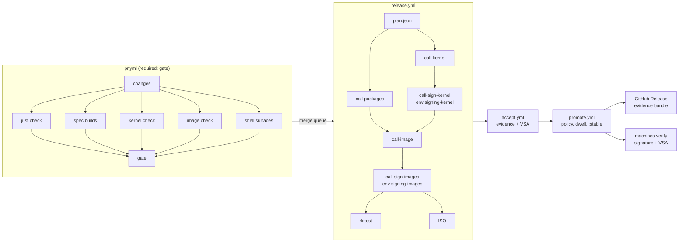

# Pipeline: target architecture of CI/CD

- **Purpose:** the target state of the pipeline that turns a commit into signed, attested,
  accepted and promoted artifacts, with the operations the EU Cyber Resilience Act expects
  of a manufacturer, and the ordered plan that reaches it. [doc_ci.md](doc_ci.md) describes
  the workflows as they are; this document describes what they become and why.
- **Owner:** the maintainer.
- **Status:** approved, revision 1 (2026-10-07). The maintainer approved the document and
  answered PQ1-PQ12 as recommended on 2026-10-07; the blocks of section 12 are built in order. Measured figures come from the GitHub API run data of 2026-09-23 to
  2026-10-07 (784 runs) collected by the pipeline review of 2026-10-07; every other number is
  labelled as an estimate.
- **Depends on:** [doc_update_delivery.md](doc_update_delivery.md) (UD1-UD44: channels,
  promotion, retention, pinning), [doc_update_trust.md](doc_update_trust.md) (UT1-UT13),
  [doc_build_ordering.md](doc_build_ordering.md) (O1-O9), [doc_build_system.md](doc_build_system.md),
  [doc_kernel_build.md](doc_kernel_build.md), [doc_system_image.md](doc_system_image.md),
  [doc_ci.md](doc_ci.md) (CI1-CI24), the secrets inventory
  [secrets.md](../operations/secrets.md), the settings record
  [github-settings.md](../operations/github-settings.md).
- **Binding decisions:** [ADR-0080](../decisions/0080-pipeline-architecture.md) (this
  architecture and the two signing environments), [ADR-0081](../decisions/0081-cra-compliance-posture.md)
  (CRA posture, support period, archive), [ADR-0082](../decisions/0082-update-control.md)
  (update control), [ADR-0075](../decisions/0075-engineering-gates.md) (`just check`),
  [ADR-0076](../decisions/0076-platform-scope-for-1-0.md), [A2-4](../decisions/0039-delivery-repairs-before-1-0.md),
  [A2-27](../decisions/0064-signing-approvals-and-mok-enrolment.md).
- **Defines:** PL1-PL53 (requirements), PB0-PB12 (plan blocks), PQ1-PQ12 (decisions on the review questions).
- **Enforced by:** `python3 scripts/verify.py` once the checks of section 10 exist; until
  then, by review against this document.

Where this document and doc_update_delivery.md cover the same ground (channels, promotion,
retention, pinning), doc_update_delivery.md stays the owner and this document cites its UD
requirements instead of restating them. This document owns the shape of the workflows, the
end-to-end trust chain, the CRA operations, the performance budget, observability and
maintainability.

## 1. Principles

Each principle names the standard it comes from. The pipeline is judged against these, not
against convenience.

| #  | Principle                                                                                                                                                | Standard                                                                                                                                                                                                                                                                                                                        |
| -- | -------------------------------------------------------------------------------------------------------------------------------------------------------- | ------------------------------------------------------------------------------------------------------------------------------------------------------------------------------------------------------------------------------------------------------------------------------------------------------------------------------- |
| 1  | Every artifact a machine or another stage consumes reaches **SLSA Build L3**: hosted, isolated build, provenance generated by a reusable workflow whose identity is the signer. | SLSA v1.0 levels, https://slsa.dev/spec/v1.0/levels; GitHub, https://docs.github.com/en/actions/security-for-github-actions/using-artifact-attestations/using-artifact-attestations-and-reusable-workflows-to-achieve-slsa-v1-build-level-3 |
| 2  | Every claim about an artifact is an **in-toto attestation** bound to its digest; the acceptance outcome is a **Verification Summary Attestation** (VSA).  | in-toto attestation framework, https://github.com/in-toto/attestation; SLSA VSA, https://slsa.dev/spec/v1.0/verification_summary                                                                                                                                                                                          |
| 3  | The secure-development practices are traceable to **NIST SSDF** (SP 800-218): PO.3.2, PO.5.1, PS.2, PS.3, PW.4, PW.7, PW.8, RV.1.1.                     | https://csrc.nist.gov/pubs/sp/800/218/final                                                                                                                                                                                                                                                                                     |
| 4  | Repository and workflow hygiene meet the **OpenSSF Scorecard** checks (Token-Permissions, Pinned-Dependencies, Branch-Protection, Code-Review, Dangerous-Workflow, SAST, Signed-Releases, Vulnerabilities, Security-Policy). | https://github.com/ossf/scorecard/blob/main/docs/checks.md; GitHub hardening guide, https://docs.github.com/en/actions/security-for-github-actions/security-guides/security-hardening-for-github-actions |
| 5  | The product meets **CRA Annex I** Parts I and II as a manufacturer would, with the obligations that apply from 2027-12-11 (ADR-0081).                    | Regulation (EU) 2024/2847, https://eur-lex.europa.eu/eli/reg/2024/2847/oj                                                                                                                                                                                                                                                       |
| 6  | **GitHub as glue.** Logic lives in scripts under the repository; a workflow checks out, calls them and uploads their output. A `run:` block holds at most about five lines. | Standing rule of 2026-09-10 (CLAUDE.md)                                                                                                                                                                                                                                                                                         |
| 7  | **One gate, run locally and in CI.** `just check` is the gate a contributor runs and the gate a pull request must pass (ADR-0075).                       | SSDF PW.7, PW.8                                                                                                                                                                                                                                                                                                                 |
| 8  | **File contracts between stages.** Stages exchange typed files in a known directory, never only `$GITHUB_OUTPUT` or an artifact name.                   | Standing rule of 2026-09-10                                                                                                                                                                                                                                                                                                     |
| 9  | **Content-addressed consumption.** Inside the build chain every input is named by digest or content hash and verified before use; no mutable tag is read. | SLSA Build L3 (isolation of inputs), SSDF PS.2, UD28, UD43                                                                                                                                                                                                                                                                       |
| 10 | **Simplest design that meets the standard.** A tool that adds an operator, a cluster or a second build language must earn its place against a repository script. | Section 11                                                                                                                                                                                                                                                                                                                      |

## 2. Decisions this document records

These are the maintainer's, and this document does not reopen them.

1. **Two signing environments (D43).** `signing-kernel` holds the Secure Boot and module
   signing keys; its job signs the NVIDIA modules and `vmlinuz`, published as `azoth-boot`.
   `signing-images` holds the cosign key. Both deploy only from the protected branches
   `iso-v0` and `main`. A release cycle asks for **at most two approvals** (amends A2-27).
   A job that holds a key builds nothing and runs no third-party action, and
   `verify.py workflows` enforces it. `MOK_PRIVATE_KEY` is retired. Agents later push with
   their own GitHub App identity, so that `prevent_self_review` can be switched on.
2. **No compiler cache for the kernel** (PR #250).
3. **CRA: comply now, at manufacturer level** (ADR-0081). Support period of five years for
   the product line, with the Fedora base rebased forward and the end date published.
   Digests promoted to `:stable` are never deleted. A signed evidence bundle per release is
   attached to a GitHub Release, with no off-GitHub copy for now. Updates are automatic by
   default, with a time-limited postpone and an opt-out with a warning (ADR-0082, amends
   A2-26 and A2-5). Full wipe follows 1.0; ADR-0076 stands and the gap is documented.
4. **Product priorities (2026-10-06):** update delivery first; the pipeline is the
   product; x86-64-v3 only.
5. **Secret scanning and push protection** are on (2026-10-07) and are part of the
   recorded settings (PL9).

Work in flight is part of the system this document targets: PR #249 (the `system` stage
built once, UD40), branch `perf/sign-only-uki` (D43), PR #250 (no kernel ccache) and the
merged PR #248 (packages consumed by content hash, `hash-` tags written last from the
signed digest).

## 3. Target topology

### 3.1 Entry workflows

Six workflows have triggers. Everything else is a reusable stage they call.

| Entry            | Triggers                                       | What it does                                                                                                                                                       |
| ---------------- | ---------------------------------------------- | ------------------------------------------------------------------------------------------------------------------------------------------------------------------ |
| `pr.yml`         | `pull_request`, `merge_group`                  | change detection, `just check`, the build checks the change selects (specs, kernel, image, shell surfaces), one aggregate job `gate`, the only required check |
| `release.yml`    | `push` to `iso-v0` and `main`, `workflow_dispatch` | plan, packages, kernel and modules when their inputs changed, signing of the kernel, images, signing of the images, `:latest`, ISO, release evidence             |
| `accept.yml`     | `workflow_call` from `release.yml`, `workflow_dispatch` with a run id | ISO and upgrade acceptance on the run's own digests (UD17, UD18), evidence files, the VSA                                       |
| `promote.yml`    | hourly `schedule`, `workflow_dispatch`         | selects the candidate with complete evidence after the dwell (UD5), runs the policy check, promotes by digest, publishes the evidence bundle                      |
| `bots.yml`       | daily `schedule`, `workflow_dispatch`          | one matrix over the bump scripts (kernel, cosmic-comp, nixpkgs registry, specs, NVIDIA locks); each opens or updates one pull request through one shared script  |
| `maintenance.yml`| daily and weekly `schedule`, `workflow_dispatch` | vulnerability rescan, settings drift check, run statistics; weekly: janitor, reproducibility and benchmark, fuzzing, patch rebase drill, two-output layout, Scorecard |

### 3.2 Reusable stages and composite actions

| Stage (reusable workflow) | Role                                                                                                    | Runs where                         |
| ------------------------- | ------------------------------------------------------------------------------------------------------- | ---------------------------------- |
| `call-builder.yml`        | the builder image, by content hash (UD42)                                                               | hosted                             |
| `call-packages.yml`       | one matrix over the dirty packages of `plan.json`; tier repositories by `hash-` tag (PR #248, UD44)      | hosted                             |
| `call-kernel.yml`         | Azoth, `azoth-devel`, the NVIDIA modules once per kernel or NVIDIA change, unsigned                      | self-hosted ephemeral guest (build), hosted (the rest) |
| `call-sign-kernel.yml`    | environment `signing-kernel`: signs the modules and `vmlinuz`, publishes `azoth-nvidia` and `azoth-boot` | hosted, pinned signer image only   |
| `call-image.yml`          | the `system` stage once and the three variants from its digest (UD40); pushes `:<run_id>` only (UD24)    | hosted                             |
| `call-sign-images.yml`    | environment `signing-images`: key-based signature, verification, then the tags (UD25)                   | hosted, pinned signer image only   |

The build stages generate SLSA provenance themselves, so the signer identity of every
attestation is the stage, not the caller (PL21).

Composite actions carry the repeated steps, never logic:

- `.github/actions/setup`: checkout and the pinned tools from the repository flake;
- `.github/actions/attest`: provenance and SBOM attestations for a digest file;
- `.github/actions/verify-input`: verifies a consumed digest against its expected signer
  identity and writes the verified digest file;
- `.github/actions/alert`: opens or updates the alert issue when a scheduled run fails (PL51).

### 3.3 File contracts

Every stage reads and writes files under `$RUNNER_TEMP/out/` and uploads that directory.
The schemas live in `scripts/ci/schemas/` and every writer validates against them.

| File                          | Writer                    | Readers                         | Content                                                                                             |
| ----------------------------- | ------------------------- | ------------------------------- | --------------------------------------------------------------------------------------------------- |
| `changes.json`                | `pr.yml` change detection | `pr.yml` jobs                   | the areas a change touches (specs, kernel, docs only; image and shell join with their `pr.yml` jobs in PB11, PB12). Known gap: `Cargo.toml`, `Cargo.lock` and `deny.toml` belong to no area yet, so a dependency change selects no build (follow-up) |
| `plan.json`                   | release `plan`            | every release stage             | dirty packages with content hashes, whether kernel or modules change, the variants of `images.json` |
| `kernel-artifacts.env`        | `system/kernel-artifacts.sh` | image, signing                | kernel, devel, module and boot digests and their registry (O5)                                      |
| `tier-digests.json`           | `call-packages.yml`       | `call-image.yml`                | tier repository digests, verified (UD44)                                                            |
| `image-digests.txt`           | `call-image.yml`          | signing, ISO, accept, promote   | `REPOSITORY TAG DIGEST` per variant (UD3)                                                           |
| `evidence/<gate>.json`        | each acceptance gate      | promote                         | UD4 evidence                                                                                        |
| `vsa.intoto.json`             | `accept.yml`              | promote, machines               | SLSA VSA over the run's digests                                                                     |
| `promotion.json`              | `promote.sh`              | evidence bundle                 | UD6 record                                                                                          |
| `metrics/<stage>.json`        | every stage               | `maintenance.yml` statistics    | durations, cache use, bytes pushed (PL53)                                                           |

### 3.4 The flow

### 3.5 Today's 24 workflows

| Workflow                         | Target                                                                                             |
| -------------------------------- | -------------------------------------------------------------------------------------------------- |
| `athanor-forge-orchestrator.yml` | replaced by `release.yml`                                                                          |
| `call-build-builder.yml`         | kept as `call-builder.yml`, consumed by digest                                                     |
| `call-dag-compile.yml`           | replaced by `call-packages.yml`: one matrix instead of three copies of the level job               |
| `call-lint.yml`                  | deleted: `just check` in `pr.yml`; the release path does not lint again (PL44)                     |
| `call-system-image.yml`          | split into `call-image.yml` and `call-sign-images.yml`                                             |
| `cosmic-comp-bump.yml`           | merged into `bots.yml`                                                                             |
| `cosmic-comp-rebase.yml`         | merged into `maintenance.yml` (weekly)                                                             |
| `forge-ghcr-cleanup.yml`         | merged into `maintenance.yml` (weekly janitor, section 5)                                               |
| `forge-util-update-specs.yml`    | merged into `bots.yml`                                                                             |
| `fuzzing.yml`                    | merged into `maintenance.yml` (weekly)                                                             |
| `iso-acceptance.yml`             | replaced by `accept.yml`, addressed by run id (UD17)                                               |
| `kernel-build.yml`               | split: the check into `pr.yml`, the build into `call-kernel.yml`, the signing into `call-sign-kernel.yml` |
| `kernel-bump.yml`                | merged into `bots.yml`                                                                             |
| `kernel-weekly.yml`              | merged into `maintenance.yml` (weekly)                                                             |
| `nix-registry-bump.yml`          | merged into `bots.yml`                                                                             |
| `nix-vanguard.yml`               | deleted: its triggers name a branch without a release role and `just check` covers the flake      |
| `nvidia-build.yml`               | merged into `call-kernel.yml`                                                                      |
| `nvidia-kmod.yml`                | split into `call-kernel.yml` (build) and `call-sign-kernel.yml` (D43)                              |
| `promote-stable.yml`             | replaced by `promote.yml`                                                                          |
| `rust-security-audit.yml`        | deleted: `cargo deny` in `just check` (ADR-0075), the daily rescan in `maintenance.yml`            |
| `shell-layout-outputs.yml`       | merged into `maintenance.yml` (weekly)                                                             |
| `shell-surfaces.yml`             | merged into `pr.yml`, selected by change detection, the bar built once (PL45)                      |
| `spec-build-check.yml`           | merged into `pr.yml`, selected by change detection                                                 |
| `system-image-check.yml`         | merged into `pr.yml`, selected by change detection                                                 |

24 files become 12 (six entries, six stages) plus four composite actions.

## 4. The trust chain, end to end

### 4.1 Source and review

**PL1. The product branches are protected by rulesets kept as code.** `iso-v0` and `main`
reject force pushes and deletions, require a pull request, require the `gate` check of
`pr.yml` and linear history. The rulesets live in `.github/settings/rulesets.json`.
(SSDF PS.1; Scorecard Branch-Protection.)

**PL2. Changes land through the merge queue.** The `gate` runs on the `merge_group` commit,
so what lands is what was tested, and the required check stays `strict: false` without
losing that guarantee. (Scorecard Branch-Protection.)

**PL3. One required check, always reported.** `gate` depends on every job of `pr.yml`, runs
with `if: always()`, and fails when any job it needs failed or was cancelled; a skipped job
is a pass. Path filters never decide whether a required workflow runs: the change-detection
job decides which jobs run, so a required check is never left pending
(https://docs.github.com/en/repositories/configuring-branches-and-merges-in-your-repository/managing-protected-branches/troubleshooting-required-status-checks).

**PL4. CODEOWNERS names existing owners and existing paths,** and `verify.py` checks both.
Pull requests opened by an agent or a bot require the review of a code owner; the
maintainer is a ruleset bypass actor, recorded in the settings file (PQ5).

**PL5. Agents and bots act through GitHub App identities, never personal tokens.** Tokens
come from `actions/create-github-app-token` per job, scoped to the repository and the
permissions the job needs, and expire within the hour. Personal access tokens are removed
from the repository secrets. Once agents push as their App, `prevent_self_review` is on in
both signing environments (D43).

**PL6. Bot pull requests merge through the same queue and the same gate.** Auto-merge is
enabled by the bot's App identity from a default-branch run, never from a job that runs
pull-request code.

### 4.2 Workflow and build isolation

**PL7. Least privilege per job.** Every workflow declares `permissions: {}` at the top and
each job asks for exactly what it uses. No workflow uses `pull_request_target` or
`workflow_run` with pull-request code. `verify.py workflows` enforces both. (Scorecard
Token-Permissions, Dangerous-Workflow.)

**PL8. Everything executed is pinned.** Actions by full commit SHA (with
`sha_pinning_required: true` in the repository settings), container images by digest
(UD43), tools from the repository flake and its `flake.lock`, never from an unpinned
`nixpkgs#` reference. `verify.py` gains a `pinning` check. (Scorecard Pinned-Dependencies;
SSDF PS.2.)

**PL9. Repository security settings are code.** Secret scanning, push protection,
private vulnerability reporting, Dependabot alerts, Actions permissions and environments
are recorded under `.github/settings/`, and the drift check of PL52 compares them with the
live repository.

**PL10. Jobs of different trust levels never share writable state.** Pull-request jobs
and release jobs never read a cache, volume or runner state the other wrote. On the
self-hosted runner each job runs in an ephemeral guest (`scripts/runner/`) whose cache
volumes are separate per trust level; a pull request from a fork never runs on it (PQ3).

**PL11. A job that holds a signing key builds nothing and runs no third-party action**
(D43). It runs the pinned signer image on the exact digests a build job handed over, and
`verify.py workflows` rejects any other step in a job that names an environment with a key.

### 4.3 Intermediate artifacts

**PL12. Every hop is consumed by digest and verified with an exact identity.** Each
artifact one stage hands to another (builder image, package images by `hash-` tag, tier
repositories, kernel, devel, modules, boot image) is resolved to a digest once, verified
with `cosign verify` (or `gh attestation verify`) against the exact certificate identity
of the stage that produced it, and used only by that digest. An identity is matched as an
exact string, not a pattern. This extends UD44 from tier repositories to every hop.

**PL13. Tags inside the build chain are names, not inputs.** `hash-<h>` and `<run_id>` tags
are written once, after the signature of the digest they name verified (PR #248, UD25);
`latest` is never read by a build stage. A pull request builds against the digests its
own pins resolve to, never against a moving tag.

**PL14. The trusted namespace is one variable.** Every image reference is built from
`REGISTRY_HOST` and the repository owner, each with a default, from one script
(`scripts/ci/registry.sh`); the variant list comes from one file,
`forge/config/images.json`. RA-12's single literal stays the only exception.

### 4.4 Signing

**PL15. Two key domains, two environments** (D43): `signing-kernel` (Secure Boot key for
`vmlinuz`, module key for the NVIDIA modules) and `signing-images` (cosign key). Each
deploys only from `iso-v0` and `main`, has `can_admins_bypass: false`, and lists required
reviewers. A release that does not change the kernel asks for one approval.

**PL16. Sign, verify, then tag** (UD25). The signing job verifies the signature it wrote
through the same policy a machine uses before any tag moves.

**PL17. Keyless signatures accompany key-based ones** (UT2): the keyless Sigstore
signature carries the workflow identity; the key-based one is what machines verify
offline.

**PL18. Key rotation and revocation are runbooks,** in `docs/operations/`, each a
sequence of releases (UD27): new key shipped in a promoted image, then used.

### 4.5 Provenance

**PL19. Every artifact has SLSA provenance:** packages, tier repositories, builder image,
kernel, devel, modules, boot image, the three system images and the ISO. Provenance is the
`https://slsa.dev/provenance/v1` predicate, generated by `actions/attest-build-provenance`
inside the stage that built the artifact.

**PL20. Provenance names its inputs by digest:** source commit, builder digest, base image
digest, tier digests, kernel artifacts. A digest absent from the provenance is an input
the build must not have read.

**PL21. Build L3 is verified, not claimed.** `scripts/ci/verify_release.sh <run_id>` runs
`gh attestation verify --signer-workflow` for every digest of the run against the stage
that must have built it, and the release evidence records the result. Public statements claim the level this script
verifies and nothing higher (RA-3).

### 4.6 SBOM

**PL22. One SBOM format: CycloneDX 1.6 JSON,** generated by the pinned syft for every
artifact of PL19 and attested with the CycloneDX predicate type. Why CycloneDX 1.6: BSI
TR-03183-2 v2.1.0, which is the most concrete technical reading of the CRA's SBOM duty
available, accepts CycloneDX 1.6 or later or SPDX 3.0.1 or later, with SHA-512 hashes
(https://www.bsi.bund.de/SharedDocs/Downloads/EN/BSI/Publications/TechGuidelines/TR03183/BSI-TR-03183-2_v2_1_0.pdf).
The pipeline emits SPDX 2.3 today, which that reading does not accept; CycloneDX 1.6 is
supported by the scanners of PL25 and by syft. SPDX 3 is reconsidered when the toolchain
emits it.

**PL23. The SBOM covers the top level and the inside.** The system images list every RPM
and, through `cargo auditable` metadata in the Rust binaries, every crate; the kernel SBOM
lists its configuration and patches; the ISO SBOM names the image digest it installs.

**PL24. The SBOM is checked, not only produced.** `scripts/ci/sbom_check.py` fails a
release whose SBOM lacks the fields TR-03183-2 lists (component name, version, supplier,
licence, SHA-512 hash, dependency relation).

### 4.7 Vulnerabilities

**PL25. Every candidate is scanned before promotion.** `scripts/vuln/scan.sh` runs grype
on the SBOM, osv-scanner on `Cargo.lock`, and `dnf updateinfo` against the image's RPM
database. Its report is an evidence file of UD4.

**PL26. Exploitability is recorded as VEX.** Statements live in
`security/vex/*.openvex.json` (OpenVEX, https://github.com/openvex/spec), are reviewed like
code, and are passed to the scanner. A finding of high or critical severity without a VEX
statement of `not_affected` or `fixed` blocks promotion.

**PL27. Promoted digests are rescanned daily** by `maintenance.yml`. A new finding against
`:stable` opens the CVD workflow of section 6 and raises the alert of PL51.

**PL28. Static analysis runs on every pull request** through `just check` (clippy, ruff,
shellcheck, actionlint, cargo deny) and CodeQL runs weekly for Rust, Python and the
workflows. (SSDF PW.7, PW.8; Scorecard SAST.)

### 4.8 Acceptance, VSA and promotion

**PL29. Acceptance produces a VSA.** `accept.yml` runs the ISO and upgrade acceptance on
the run's own digests (UD17, UD18) and writes a SLSA VSA
(`https://slsa.dev/verification_summary/v1`) whose `resourceUri` is each digest, whose
`policy` names the version of `scripts/ci/policy.json`, and whose `verifiedLevels` records
the SLSA level PL21 verified. The VSA is attested keylessly by `accept.yml`.

**PL30. Promotion verifies a policy, not a list of files.** `promote.sh` calls
`scripts/ci/policy_check.py`, which reads `policy.json` and verifies, for every digest:
the key-based signature, provenance from the expected stage, an SBOM that passes PL24, a
scan without blocking findings (PL26), the VSA, and the evidence of UD4 including
`hardware` for the NVIDIA variants. It is the same idea as Conforma's policy evaluation,
implemented in one repository script.

**PL31. A release carries a monotonic version.** The version serial of UT9 is set when
the release is dispatched and signed with the images, in the key-signed attestation of the
`signing-images` job that also carries the security class (PQ4), so an offline machine
verifies it with the shipped key (UT2, UT3). A machine refuses an image whose version is
lower than the one it runs (UT5, UD7). This gives the rollback protection of TUF without a
TUF repository (section 11). Freeze protection, an expiry that machines enforce, needs a
signature renewed on a schedule, and so a key in a scheduled job; promotion holds no key
(PL42). An expiry is therefore not part of this design: it needs a new requirement in
doc_update_trust.md before any key is placed in a scheduled job.

### 4.9 Install path and machines

**PL32. The ISO is signed and names its image by digest.** The ISO is built after the
images are signed, so its `SHA256SUMS` is signed keylessly (Sigstore) by the stage that
built it, with build provenance beside it, and published with the ISO: no key and no
approval, and a user verifies it with `cosign verify-blob` against that exact workflow
identity (PQ2). The kickstart installs the promoted digest through the signed transport
(UD2), and the installer carries the policy of UT3 (UD22).

**PL33. Every machine verifies before it switches** (UD11, UD23): signature through the
shipped policy, and from 1.0 the promotion attestation of PL31.

**PL34. The maintainer's machines leave the unverified transport** by UD15's three steps,
onto `ostree-image-signed` under `ars-regia` (UD11), as block PB6 with a maintainer
action.

## 5. Release channels and retention

**PL35. One rule per tag, one writer per tag** (UD1). `:<run_id>` and `hash-<h>` are
immutable names written once; `:latest` is written only by `call-sign-images.yml` on a
push to the default branch after verification, for every image (system images, ISO,
kernel), so there is one `latest` rule, not four; `:stable`, `:stable-previous`,
`:stable-<YYYYMMDD>` only by `promote.sh`. `verify.py workflows` enforces the writer of
each (UD1 acceptance).

Retention, by ADR-0081 (this amends the 90-day figure of UT10 and UD8):

| What                                                                 | Kept                                                         |
| -------------------------------------------------------------------- | ------------------------------------------------------------ |
| digests ever promoted to `:stable`, their signatures and attestations | forever (never deleted from GHCR)                            |
| `hash-<h>` package and tier images                                   | forever: they are the inputs a promoted release rebuilds from |
| ISOs of promoted runs                                                | forever (UD8)                                                |
| `:<run_id>` images never promoted                                    | 90 days                                                      |
| untagged manifests not referenced by a kept index or signature       | 7 days                                                       |
| evidence bundle per promoted release                                 | attached to its GitHub Release, never deleted                |

The janitor (`forge/scripts/clean_ghcr.sh`, weekly in `maintenance.yml`) always runs its
dry run first and refuses to delete anything the table keeps.

**The support period** is five years for the product line from the date it is placed on
the market, with the Fedora base rebased forward within the line (ADR-0081, amends
A2-17). The end date is published in `SECURITY.md`, in the release notes and as
`SUPPORT_END` in `/usr/lib/os-release`.

## 6. CRA operations

Items marked [LAWYER] need legal confirmation before they are relied on; the CRA review
of 2026-10-07 found that Athanor, distributed free of charge by a natural person, is
probably outside the CRA today [LAWYER], and the maintainer chose to meet the
manufacturer's obligations anyway (ADR-0081).

**PL36. Classification is recorded.** An operating system is an important product of
class I (Annex III, item 11). Each variant is a product. The conformity route for free
and open-source software under Art. 32(5) applies, with the technical documentation
public [LAWYER].

**PL37. Coordinated vulnerability disclosure.** `.github/SECURITY.md` is the CVD policy
(Annex I Part II(5)): the reporting channel (GitHub private vulnerability reporting, plus
an e-mail address, PQ8), what is in scope, the response times the maintainer commits to,
the support period and its end date, and how advisories are published.

**PL38. Art. 14 reporting runbook.** `docs/compliance/reporting-runbook.md` describes, for
an actively exploited vulnerability or a severe incident: the 24-hour early warning, the
72-hour notification, the final report (14 days after a fix for a vulnerability, one month
for an incident), through the ENISA single reporting platform
(https://portal.cra-srp.enisa.europa.eu/) to the coordinating CSIRT (CSIRT Italia
[LAWYER]), and the notice to users. Art. 14 applies from 2026-09-11 to products in scope.

**PL39. Advisories are CSAF 2.0 and GHSA.** Every fixed vulnerability gets a GitHub
security advisory and a CSAF 2.0 document
(https://docs.oasis-open.org/csaf/csaf/v2.0/os/csaf-v2.0-os.html) published as a provider
on the project's Pages site, with the VEX statements of PL26 as its product status. (Annex
I Part II(4), (6), (8).)

**PL40. Technical documentation exists in the repository.** `docs/compliance/` holds the
Annex VII skeleton: product description and intended use, design and development (links
to `docs/architecture/`), the cybersecurity risk assessment, the Annex I mapping (each
essential requirement to the requirement or check that meets it), the SBOM location, the
support period, the EU declaration of conformity template [LAWYER]. It is kept ten years
after the last product of the line is placed on the market (Art. 13(13)), which the git
history and the GitHub Releases provide.

**PL41. Security updates are separate and free.** The security class of UT13 is the CRA's
security update (Art. 13(8), (9); Annex I Part II(8)); it is never bundled behind a
feature confirmation, and update control follows ADR-0082: automatic by default, a
postpone limited in time, an opt-out in Settings with a warning (Annex I Part I(2)(c)).

**PL42. The evidence bundle.** Each promotion publishes a GitHub Release named after the
version (UT9), with the SBOMs, provenance, VSA, scan report, VEX, `promotion.json` and
the acceptance evidence, plus a `bundle.sha256` file that `promote.yml` signs keylessly (Sigstore, the workflow
identity), since the bundle exists only at promotion, long after the release's signing
jobs ended; promotion therefore holds no key. ADR-0081 accepts GitHub as the only store
for now.

Known gaps, documented in `docs/compliance/` rather than hidden: full wipe (LUKS
crypto-erase) after 1.0 (ADR-0076), the harmonised standards still in draft (ETSI EN
304 626 for operating systems, prEN 40000-1-3), the logging opt-out (Annex I Part I(2)(l))
[LAWYER].

## 7. Performance

### 7.1 Measured baselines

Wall time is `updated_at - created_at` of a run, which includes queue and approval waits;
p50/p90 over successful runs. Source: run data of 2026-09-23 to 2026-10-07, recomputed for
this document from the review's export.

| Path                            | Runs (success) | Wall p50 / p90 (min) | Notes                                                                                               |
| ------------------------------- | -------------- | -------------------- | --------------------------------------------------------------------------------------------------- |
| Kernel Build (every PR and push) | 216 of 321    | 10.9 / 77.1          | reuse path p50 9.9 min; compile 48-74 min, p50 65.8 min (21 builds)                                  |
| System Image Check              | 44 of 129      | 26.3 / 58.6          | 34% success over the window                                                                         |
| Shell surfaces                  | 56 of 70       | 17.5 / 36.0          | the bar is built in 14 jobs: 75.1 of 203 job-minutes per run, the largest job-hour consumer (128 h) |
| Spec Build Check                | 53 of 77       | 5.0 / 28.9           |                                                                                                     |
| Orchestrator, image runs        | 18             | 113 / 299            | about 62 min of work, 6.5 min of repeated lint, 38.7 min (34%) of approval wait                      |
| Orchestrator, all               | 22 of 95       | 108.9 / 298.9        | 50 of 95 cancelled; 25.9 h of self-hosted time on cancelled builds                                  |
| Docs-only PR gate               | 1 (run 37543730456) | 7.5             | a documentation change runs Kernel Build                                                            |

Other measured facts: the Actions cache held 10.78 GB against the 10 GB limit, with a
Rust cache no job restores; before PR #248, 89% of DAG job-minutes rebuilt nothing; the
declared timeouts are 5 to 20 times the longest observed run (kernel 360 min against a
74-minute maximum, system image 180 against 55, DAG levels 60 against about 3.3, modules
60 against 5).

### 7.2 Targets

Targets are estimates until PB11 measures them; each becomes a metric of PL53.

| Path                                    | Target wall p50                                       | How                                                                               |
| --------------------------------------- | ----------------------------------------------------- | --------------------------------------------------------------------------------- |
| PR, documentation only                  | 3 min (estimate)                                      | change detection selects only the documentation checks of `just check`            |
| PR, code without kernel                 | 25 min, p90 40 (estimate)                             | only selected builds; bar built once; kernel job skipped                           |
| Release without kernel change           | 60 min to a signed `:latest`, one approval (estimate) | no repeated lint; one package matrix; `system` once (UD40); `signing-images` only |
| Kernel bump                             | 100 min to a signed `:latest`, two approvals (estimate) | modules built once per kernel; compile on the self-hosted guest; no ccache (PR #250) |

**PL43. Kernel builds run only when kernel inputs change.** The change-detection job
decides; Kernel Build no longer runs on unrelated pull requests.

**PL44. The release path does not repeat what the merge queue proved.** `just check`
runs once, on the `merge_group` commit; `release.yml` starts from the plan. `release.yml`
refuses a commit whose `gate` check is not green, so a push that bypasses the queue (PQ5)
is not released unchecked.

**PL45. The bar is built once per run** and its output passed to the jobs that test it.

**PL46. NVIDIA modules are built once per kernel or NVIDIA change,** in `call-kernel.yml`,
and reused by digest everywhere else.

**PL47. Timeouts are sized from data.** Every job declares `timeout-minutes`, set to the
measured p99 of its successful runs times 1.5, rounded up to five minutes, and reviewed
from the weekly statistics; `verify.py workflows` fails a job without one.

**PL48. One package matrix, with a cycle check.** The levels are removed: specs build
with `--nodeps` (`forge/scripts/build_spec.sh`, lines 68 and 70) and no build consumes
another's output (doc_build_system.md), so every dirty package builds in one matrix.
`forge/scripts/dag_orchestrator.py` keeps the graph for content hashes and runtime
requirements and runs `graphlib.TopologicalSorter.prepare()`, which raises `CycleError`
on a cycle; a cycle fails the plan. The graph had one, `update → recovery → update`,
made of a tier edge (every `custom_tier3` package depends on every `custom_tier2` one)
and the runtime `Requires: athanor-update` of `athanor-recovery` (PQ11). The same
requirement broke the image build, which installs each tier in a dnf transaction of its
own: `athanor-recovery` now ships in `custom_tier3`, and the plan fails on a runtime
requirement of a later tier (`tier_inversions`).

**PL49. Concurrency does not waste builds or hold the queue.** Pull-request runs cancel
their predecessor. Release runs queue on the build jobs and are never cancelled after
packages started; concurrency is declared per job, so a run waiting for an approval does
not block the next run's builds, and a superseded run's pending signing job is
cancelled by the next one. The nightly orchestrator schedule is removed: a release runs
when something merged.

**PL50. Caches hold what is restored.** A cache no job restores is removed, and the
`maintenance.yml` statistics report cache size against the limit.

## 8. Observability

**PL51. A scheduled run that fails is seen.** Every scheduled job ends with the `alert`
composite action, which opens or updates one issue per workflow and job labelled
`ci-alert`, and closes it on the next success. No scheduled failure stays silent.

**PL52. Settings drift is detected daily.** `scripts/ci/settings_drift.py` compares
`.github/settings/*.json` with the live repository (rulesets, environments, Actions
permissions, security features) using a read-only App token, and raises PL51's alert on a
difference.

**PL53. Every stage records its metrics.** Each stage writes `metrics/<stage>.json`;
`maintenance.yml` aggregates the week's runs through the API (`scripts/ci/run_stats.py`)
into the figures of section 7.1, so the baselines of this document are regenerated, not
hand-copied.

## 9. Maintainability by agents

- **Every standing rule is a check.** "GitHub as glue" becomes `verify.py workflows`
  rules: a `run:` block of at most five lines, no `|| true`, no `continue-on-error`, data
  between steps only through files under `$RUNNER_TEMP/out/`, no literal registry owner
  (exists: `registry`), pinning (PL8), permissions (PL7), timeouts (PL47), key isolation
  (PL11), one writer per tag (PL35).
- **`just check` runs every verify check** and the four test directories that no
  workflow runs today; the findings red at adoption are listed one by one in
  `scripts/ci/known-red.txt` (the finding text without line numbers, each with an issue
  and an expiry date), any finding not listed is red, and the list may only shrink (PQ12).
- **doc_ci.md is checked against the tree** (`verify.py ci`, exists) and gains the
  stage and contract tables generated from the workflow files, so the description cannot
  drift.
- **Runbooks** in `docs/operations/ci-runbook.md`: a failed release, a stuck approval, a
  key rotation, a red scheduled job, a GHCR restore, a CRA report.
- **Settings as code** (PL9, PL52): a live change is made by editing the file and applying
  it, never the other way.
- **Bots are scripts.** Each bump is `scripts/bump/<name>.sh`, which writes the change; one
  script opens the pull request. Dependabot keeps only GitHub Actions and Cargo; the
  flake inputs move with the nixpkgs registry bump.

## 10. What verify gains

| Check              | Requirement                                                                 |
| ------------------ | --------------------------------------------------------------------------- |
| `workflows` (ext.) | PL3, PL7, PL11, PL35, PL47, section 9 rules                                 |
| `pinning` (new)    | PL8, PL13                                                                    |
| `owners` (new)     | PL4                                                                          |
| `graph` (new)      | PL48 (`graphlib` cycle check on the package graph)                           |
| `images` (new)     | PL14 (one variant list, used by every workflow and script)                   |
| `settings` (new)   | PL9 (files present and well-formed; the live comparison is PL52's job)      |

## 11. Alternatives rejected

| Alternative                                   | Why not                                                                                                                                                                  |
| --------------------------------------------- | ------------------------------------------------------------------------------------------------------------------------------------------------------------------------ |
| Konflux, Tekton Chains, Conforma as a service | they need a Kubernetes cluster to operate; principle 6 puts the logic in scripts, and PL30 implements the policy evaluation in one script against the same attestations |
| A full TUF repository                         | rollback protection is what Athanor needs from TUF now; PL31 gives it with a version inside an attestation machines already verify. Freeze protection is deferred (PL31)                  |
| Bazel or Buck2                                | a second build language for one maintainer and agents; content addressing already comes from OCI digests and `hash-` tags                                                |
| Nix or Hydra as the CI driver                 | Nix stays the builder (A2-13); a second scheduler duplicates GitHub's without a gain the plan needs                                                                      |
| slsa-github-generator                         | `actions/attest-build-provenance` in reusable workflows reaches Build L3 with a maintained action                                                                         |
| A compiler cache for the kernel               | decided against (PR #250)                                                                                                                                                |
| `paths:` filters on required workflows        | a filtered required workflow stays pending; PL3's change detection replaces them                                                                                         |
| An evidence copy outside GitHub               | ADR-0081: GitHub Releases are the archive for now; revisited when the support period starts                                                                              |
| Signing RPMs                                  | RPMs reach a machine only inside the signed image, whose tier digests are verified (UD44, decision 6 of doc_update_delivery.md)                                          |

## 12. The plan in blocks

Each block ends at its gate; the next starts when the gate is green, unless the
dependency column says otherwise. Effort is an estimate in agent-days. **[M]** marks a
step only the maintainer can take.

| Block | Goal | Scope | Gate | Depends on | Effort |
| ----- | ---- | ----- | ---- | ---------- | ------ |
| **PB0** | Publication under `ars-regia` and the two signing environments (D43) | branch `perf/sign-only-uki`, PR #249, `.github/settings/environments.json`, `nvidia-kmod.yml`, `call-system-image.yml`, `docs/operations/secrets.md` | `python3 scripts/verify.py workflows` green with the key-isolation rule; one release run on `iso-v0` publishes three signed `:<run_id>` images under `ars-regia` with at most two approvals; the live environments list `signing-kernel` and `signing-images`, deployable from `iso-v0` and `main` only; `MOK_PRIVATE_KEY` absent | PR #249 | 2-3 (estimate) |
| | **[M]** create the two environments, move the secrets, delete `MOK_PRIVATE_KEY`, approve the run | | | | |
| **PB1** | One gate (ADR-0075) | `pr.yml`, `Justfile` (`check`), `scripts/ci/changes.py`, `scripts/ci/gate.py` | `just check` passes locally and in `pr.yml`; a documentation-only PR finishes with Kernel Build skipped and `gate` green; a PR with a failing selected job has `gate` red | PB0 | 3 (estimate) |
| | **[M]** switch the required check of `iso-v0` and `main` from `Kernel gate` and `Spec gate` to `gate` (`docs/operations/github-settings.md` section 8); until then and the follow-up that drops their `pull_request` triggers, Kernel Build still runs on a documentation-only PR, while the `kernel` job of `pr.yml` is skipped | | | | |
| **PB2** | Source, review and settings controls, alerting | `.github/settings/rulesets.json`, `actions.json`, `environments.json`, `CODEOWNERS`, `scripts/ci/settings_drift.py`, `.github/actions/alert` | `python3 scripts/ci/settings_drift.py` exits 0 against the live repository; `gate` is the required check of both product branches; the three personal tokens are absent from the secrets list; a forced failure of a scheduled job opens a `ci-alert` issue | PB1 | 2 (estimate) |
| | **[M]** create the GitHub App and its secrets, apply the rulesets, enable the merge queue and SHA pinning | | | | |
| **PB3** | Pinned inputs, verified hops (PL8, PL12-PL14) | `.github/actions/verify-input`, `scripts/ci/registry.sh`, `forge/config/images.json`, every workflow `uses:` | `python3 scripts/verify.py pinning images` green; a release run's logs show a verification for every hop of PL12 | PB1 | 3-4 (estimate) |
| **PB4** | SLSA Build L3 provenance and CycloneDX SBOM for every artifact | the six stages, `.github/actions/attest`, `scripts/ci/verify_release.sh`, `scripts/ci/sbom_check.py` | `scripts/ci/verify_release.sh <run_id>` exits 0 for a release run, covering every digest in `image-digests.txt` and `kernel-artifacts.env` | PB3 | 3 (estimate) |
| **PB5** | Evidence, VSA and the policy gate | `accept.yml`, `promote.yml`, `system/promote.sh`, `scripts/ci/policy_check.py`, `scripts/ci/policy.json` | doc_update_delivery.md phases P1 and P2 gates, plus: `policy_check.py` refuses a candidate with each single piece of evidence removed (unit test), and the first automatic promotion carries a VSA | PB4 | 4 (estimate) |
| **PB6** | Signed install path, machines on the signed transport | keyless ISO signing in the stage that builds the ISO (PL32), `system/athanor-install.ks`, UD15 | the ISO acceptance asserts `ostree-image-signed` and a digest reference; the desktop and laptop origin files name `ostree-image-signed` under `ars-regia` | PB5 | 2 (estimate) |
| | **[M]** UD15 on the desktop and laptop (needs `sudo`) | | | | |
| **PB7** | CVD, support period, documentation | `.github/SECURITY.md`, `docs/compliance/` (Annex VII skeleton, Annex I mapping, reporting runbook), `os-release` `SUPPORT_END` | `python3 scripts/verify.py docs` green with the new files; `grep SUPPORT_END /usr/lib/os-release` in the image acceptance | PB0 (parallel with PB1-PB6) | 2 (estimate) |
| | **[M][LAWYER]** e-mail channel, coordinating CSIRT, the declaration template | | | | |
| **PB8** | Scanning, VEX, advisories | `scripts/vuln/scan.sh`, `security/vex/`, CSAF provider on Pages, CodeQL in `maintenance.yml` | a candidate with an unresolved critical finding is refused by `policy_check.py`; the daily rescan of `:stable` runs green or alerts; one CSAF document validates against the CSAF 2.0 schema | PB5 | 3 (estimate) |
| **PB9** | Retention and the evidence archive | `forge/scripts/clean_ghcr.sh`, `promote.yml` (GitHub Release), UT10 and UD8 text | the janitor dry run deletes nothing the table of section 5 keeps; the first promotion has a GitHub Release with the bundle and a verifying `bundle.sha256` signature | PB5 | 2 (estimate) |
| **PB10** | Update control (ADR-0082) | `athanor-update`, Settings, doc_update_trust.md (UT13) | dev-VM harness: a security update applies at the next shutdown by default; postpone holds it until its limit, then it applies; the opt-out stops automatic application, shows the warning, and still notifies | PB5 | 3 (estimate) |
| **PB11** | Performance | `pr.yml` selections, the bar job, timeouts, concurrency, caches, NVIDIA modules once | the section 7.2 targets measured by `scripts/ci/run_stats.py` over five runs per path | PB1 | 3 (estimate) |
| **PB12** | Topology consolidation | the 24 workflows to the 12 of section 3, `bots.yml`, `maintenance.yml`, `dag_orchestrator.py` (PL48), doc_ci.md, `docs/operations/ci-runbook.md` | `ls .github/workflows` matches section 3; `python3 scripts/verify.py` green with the checks of section 10; a release run with a dirty package at graph depth 3 or more builds it in the single matrix | PB3, PB11 | 5 (estimate) |

## 13. Decisions on the review questions

The maintainer answered every question as recommended on 2026-10-07. Items marked
[LAWYER] stand as decided and are confirmed with counsel before the CRA obligations apply.

| #    | Question | Decision |
| ---- | -------- | -------------- |
| PQ1  | Does `main` keep a release role, now that `iso-v0` is the default branch? | Keep it protected by the same ruleset and frozen, since D43 allows it to deploy; decide its future with the 1.0 branch model. |
| PQ2  | How is the ISO signed? | Keylessly, by the stage that builds it (PL32): the ISO is built after the images are signed, so signing it with the cosign key would need a second `signing-images` job and a third approval. A key-based signature for offline verification is reconsidered if users ask for it. |
| PQ3  | Where do kernel builds of pull requests run? | Same-repository pull requests on the ephemeral self-hosted guest with a pull-request-only cache volume; forks never on self-hosted. |
| PQ4  | Who signs the security class of a release? Today a security-class promotion goes through `promote.sh` in a signing environment (doc_update_delivery.md, decision 3), which can make three approvals in a cycle. | Set the class when the release is dispatched with its advisory ids, and sign it in `signing-images` with the images; `promote.yml` then holds no key. |
| PQ5  | Review on the maintainer's own pull requests | Maintainer as a recorded ruleset bypass actor; agent and bot pull requests require a code-owner review; `prevent_self_review` on once agents push as their App. |
| PQ6  | Length of the postpone (ADR-0082) | One postpone per update, up to seven days, then the update applies at the next shutdown. |
| PQ7  | What is the "product line" whose five years run, and from when? | Each major version (1.x), from the date 1.0 is placed on the market; `SUPPORT_END` set from it. |
| PQ8  | The CVD contact besides GitHub private reporting | A project e-mail alias owned by the maintainer, named in `SECURITY.md` [LAWYER for the CSIRT]. |
| PQ9  | Are the SBOMs public? | Yes, in the evidence bundle: the product is open source and publication costs nothing. |
| PQ10 | Visibility of `azoth-nvidia` | Public for the open-module branch; the legacy branch only after a licence check [LAWYER]. |
| PQ11 | Which edge of the `update → recovery` cycle is wrong? | Drop the synthetic all-to-all tier edges and build the graph from the specs' requirements only; tiers stay as publication groups. The edge removal lands with the `graph` check, in PB12. |
| PQ12 | Red verify checks when `just check` becomes the gate | Adopt with `known-red.txt` (one entry per finding, not per check, with issue and expiry; only shrinking) rather than blocking PB1 on fixing them all first. |

## 14. Changes to other documents

- doc_ci.md: points to this document as the target (done with this revision); its tables
  become generated in PB12.
- doc_update_delivery.md: UD8's 90-day figure and UT10 follow section 5; UD5's promotion
  gains the policy check of PL30.
- doc_update_delivery.md: UD6 and decision 3 of section 15 follow PQ4. The security class
  and the version serial are set when the release is dispatched and signed by the
  `signing-images` job with the images; `promote.sh` holds no key, and promotion is keyless
  in every class. UD6's workflow identity `promote-stable.yml` becomes `promote.yml` (PB5).
- doc_update_trust.md: UT13 follows ADR-0082 (postpone and opt-out). Its security-class
  marker and test 18 read the class from the key-signed attestation of the `signing-images`
  job, not from a promotion attestation (PQ4).
- `docs/operations/secrets.md`: the two environments and the App replace the personal
  tokens and `signing`.
